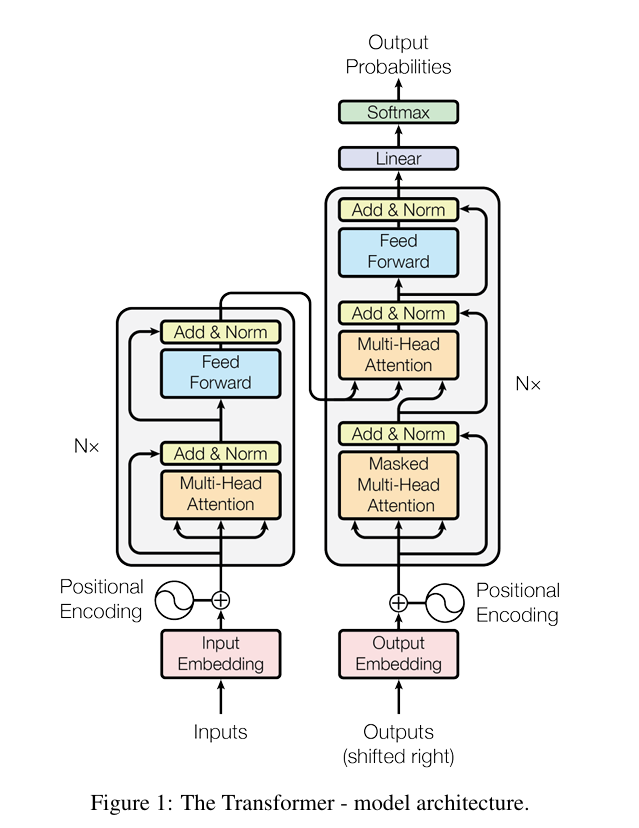
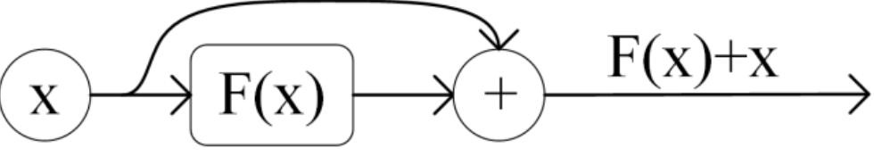
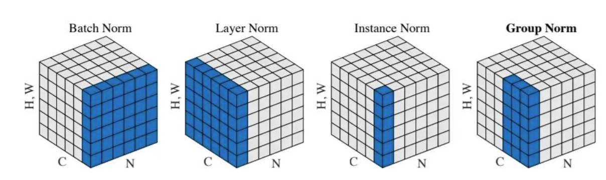

Transformer 结构中的 Add & Norm 由 Add 和 Norm 两部分组成：Add 指残差连接，Norm 指层归一化。它们共同作用于模型的各个子层，以提高训练效率和稳定性。

以原始 Transformer 的 Post-LN 结构为例，两个子层的计算分别是：

$$
\operatorname{LayerNorm}\left(X+\operatorname{MultiHeadAttention}(X)\right),
$$

$$
\operatorname{LayerNorm}\left(X+\operatorname{FeedForward}(X)\right).
$$

其中，$X$ 表示 Multi-Head Attention 或 Feed Forward 的输入，两个子层的输出与 $X$ 维度相同，因此可以直接相加。

Add 对应 $X+\operatorname{MultiHeadAttention}(X)$ 或 $X+\operatorname{FeedForward}(X)$。它是一种残差连接，通常用于解决深层网络训练困难的问题。Norm 对应 Layer Normalization，它把每个 token 的特征调整到相对稳定的数值尺度，从而加快收敛并改善训练稳定性。

## 残差连接（Residual Add）

残差连接主要解决深层神经网络越来越难训练的问题。它的典型形式是：

$$
y=F(x)+x,
$$

其中：

- $x$：这一层的输入；
- $F(x)$：若干网络层对 $x$ 做出的变换；
- $y$：输出。

核心思想是：网络不必重新学习完整映射，只需要学习相对于输入的变化量。

### 1. 解决深层网络的退化问题

理论上，网络层数增加，表达能力应该更强，至少不应该比浅层网络差。新增的层完全可以什么都不做，直接实现恒等映射：

$$
H(x)=x.
$$

这样深层网络至少可以退化成浅层网络。但实际训练中，普通网络很难让新增的多层精确学习恒等映射，结果可能出现：

- 训练误差反而升高；
- 测试误差也升高；
- 网络越深，效果越差。

这称为网络退化问题，它不是单纯的过拟合。有了残差连接：

$$
H(x)=F(x)+x.
$$

要实现恒等映射，只需要令：

$$
F(x)=0.
$$

相比让多层网络直接学习 $H(x)=x$，让残差分支学习接近 0 通常更容易。

### 2. 缓解梯度消失，使深层网络更容易训练

普通网络中，假设多层变换为：

$$
x_{l+1}=F_l(x_l).
$$

反向传播时：

$$
\frac{\partial x_L}{\partial x_l}
=\prod_{i=l}^{L-1}\frac{\partial F_i}{\partial x_i}.
$$

梯度需要连续乘很多个雅可比矩阵。如果每一项的模长都小于 1，梯度会越来越小，出现梯度消失。

加入残差后：

$$
x_{l+1}=x_l+F_l(x_l).
$$

对应的雅可比矩阵为：

$$
\frac{\partial x_{l+1}}{\partial x_l}
=I+\frac{\partial F_l}{\partial x_l}.
$$

这里多出了恒等项 $I$。因此反向传播时，即使残差分支 $F$ 的梯度很小，梯度仍然可以沿恒等路径传播：

$$
\frac{\partial x_{l+1}}{\partial x_l}\approx I.
$$

可以直观理解为：普通网络只有一条崎岖小路，残差连接额外修了一条直通道路。但残差连接只是缓解梯度消失和训练困难，不代表它能无条件彻底消除梯度消失或梯度爆炸。

### 3. 保留原始信息，减少信息丢失

如果没有残差连接，每一层都要对上一层输出进行完整变换。经过很多层后，早期信息可能逐渐丢失。残差连接让输入直接加入输出，所以输出中至少保留了输入的一条直接通路。

这对于 Transformer 尤其重要。例如：

$$
x'=x+\operatorname{Attention}(x).
$$

这表示 Attention 不需要完全替换原来的 token 表示，而是在原表示上补充上下文信息。后面的 FFN 也是：

$$
y=x'+\operatorname{FFN}(x').
$$

FFN 只需要对表示进行增量调整。因此，Transformer 每一层更像是在保留原有语义的基础上，再逐步增加或修正一部分信息。

### 4. 将“学习完整映射”变成“学习修正量”

很多深层网络中，每一层对表示的修改实际上都比较小。残差结构非常适合这种“逐层微调”的过程。例如大模型中的某一层可能只是：

- 增强某些 token 之间的关联；
- 补充少量语义信息；
- 调整某些特征方向；
- 对已有表示做小幅修正。

因此，学习残差通常比学习完整表示更容易。

残差连接主要解决三个问题：深层网络退化、梯度传播困难和信息容易丢失。它让网络加深时更容易保持原有能力，为梯度提供恒等直通路径，也让原始表示能够跨层保留。

## Norm（层归一化）

归一化是一种数据处理技术，旨在通过线性或非线性变换，将输入数据或神经网络层的输出映射到特定的数值范围或分布中。这一过程对于提升训练稳定性、加快收敛以及改善模型性能十分重要。

神经网络中常见的归一化方法包括：

- **批归一化（Batch Normalization）**：在 batch 维度上统计均值和方差，能降低网络对初始化和学习率的敏感性，也有一定的正则化效果；
- **层归一化（Layer Normalization）**：对单个样本自身的特征维度做归一化，不依赖同一批次中的其他样本；
- **组归一化（Group Normalization）**：把特征划分为多个小组，再在各组内做归一化。

Transformer 使用的是层归一化。LayerNorm 主要做一件事：把一个 token 的各个特征维度调整到相对稳定的数值范围。它在 Transformer 中几乎是标准组件，主要作用是让网络训练更稳定、梯度传播更顺畅。

### LayerNorm 到底归一化什么

假设一个 token 的隐藏向量维度是 4：

$$
x=[1,2,3,4].
$$

LayerNorm 会在这 4 个特征维度上计算均值和方差。均值为：

$$
\mu=\frac{1+2+3+4}{4}=2.5.
$$

方差为：

$$
\sigma^2
=\frac{(1-2.5)^2+(2-2.5)^2+(3-2.5)^2+(4-2.5)^2}{4}
=1.25.
$$

然后对每一个维度做归一化：

$$
\hat{x}_i=\frac{x_i-\mu}{\sqrt{\sigma^2+\epsilon}}.
$$

忽略很小的 $\epsilon$，得到大约：

$$
\hat{x}=[-1.34,-0.45,0.45,1.34].
$$

归一化后，均值大约为 0，方差大约为 1。注意，它不是把所有值压到 $[0,1]$，而是把数据中心移动到 0 附近，同时调整尺度。

### 为什么需要 LayerNorm

神经网络经过很多层变换后，隐藏状态的数值可能越来越不稳定。例如某一层输入是：

$$
[0.2,-0.1,0.3],
$$

经过若干层以后可能变成：

$$
[100,-50,80],
$$

或者：

$$
[0.0001,-0.0002,0.0003].
$$

数值过大可能带来梯度爆炸、激活值异常、Softmax 过度饱和和训练震荡；数值过小则可能带来梯度消失、参数更新缓慢和有效信息被淹没。LayerNorm 会把输入重新拉回一个较稳定的尺度。可以把它理解为：每经过一个模块，都重新校准一下当前 token 的特征分布。

### Transformer 中的输入形状

Transformer 的隐藏状态通常写作：

$$
X\in\mathbb{R}^{B\times T\times D},
$$

其中：

- $B$：batch size；
- $T$：序列长度；
- $D$：隐藏维度。

例如 $X.\operatorname{shape}=[2,3,4]$，表示 2 个样本、每个样本 3 个 token、每个 token 是 4 维向量。LayerNorm 通常针对最后一个维度 $D$ 做归一化，也就是每个 token 独立计算：

$$
\mu_{b,t}=\frac{1}{D}\sum_{i=1}^{D}X_{b,t,i},
$$

$$
\sigma^2_{b,t}=\frac{1}{D}\sum_{i=1}^{D}\left(X_{b,t,i}-\mu_{b,t}\right)^2.
$$

因此，$X_{b,t,:}$ 中的每一个 token 向量会单独归一化，不同 token 之间不会混在一起计算。

### 为什么归一化后还需要 $\gamma$ 和 $\beta$

完整的 LayerNorm 不只是标准化：

$$
\hat{x}_i=\frac{x_i-\mu}{\sqrt{\sigma^2+\epsilon}},
$$

还会进行一次可学习的缩放和平移：

$$
y_i=\gamma_i\hat{x}_i+\beta_i,
$$

其中，$\gamma$ 是可学习的缩放参数，$\beta$ 是可学习的偏移参数。若隐藏维度为 $D$，那么：

$$
\gamma,\beta\in\mathbb{R}^{D}.
$$

强制所有数据始终保持均值 0、方差 1，可能会限制模型的表达能力。加入 $\gamma$ 和 $\beta$ 后，模型可以自己决定某个维度应该放大、缩小或偏移，也可以恢复到某种特定的数值分布。

例如：

$$
\hat{x}=[-1,0,1],\qquad
\gamma=[2,1,0.5],\qquad
\beta=[1,0,-1],
$$

那么输出为：

$$
y=\gamma\odot\hat{x}+\beta=[-1,0,-0.5].
$$

因此，LayerNorm 不是单纯“抹平数据”，而是先把输入变得稳定，再让模型通过可学习参数重新调整。

### LayerNorm 和 BatchNorm 的区别

这是很容易混淆的地方。BatchNorm 通常对同一个特征维度在 batch 中进行统计。假设：

$$
X\in\mathbb{R}^{B\times D},
$$

它对第 $i$ 个特征统计不同样本之间的均值和方差，也就是跨样本计算。LayerNorm 则对每个样本自身的特征做归一化；在 Transformer 中，就是每个 token 独立归一化其隐藏维度。

### 为什么 Transformer 更适合 LayerNorm

Transformer 常见输入具有以下特点：

- 序列长度可能不一致；
- batch size 可能很小；
- 推理阶段经常一个 token 一个 token 生成；
- 不同 token 的分布可能差异很大。

BatchNorm 依赖 batch 统计量。如果 batch 很小，均值和方差就不稳定。尤其在大模型 decode 阶段，可能一次只有：

$$
B=1,\qquad T=1.
$$

这时 BatchNorm 很难获得可靠的跨样本统计信息。LayerNorm 不依赖其他样本，只使用当前 token 自己的隐藏维度，所以：

- batch 大小不影响结果；
- 训练和推理逻辑一致；
- 适合变长序列；
- 适合自回归生成。

因此，Transformer 通常采用 LayerNorm，而不是 BatchNorm。

## LayerNorm 与残差连接的关系

Transformer 中，LayerNorm 经常和残差连接一起出现。常见形式包括 Pre-LN：

$$
x+\operatorname{Attention}(\operatorname{LN}(x)),
$$

以及原始 Transformer 使用的 Post-LN：

$$
\operatorname{LN}\left(x+\operatorname{Attention}(x)\right).
$$

残差连接负责提供信息和梯度的直通路径，LayerNorm 负责控制每层输入或输出的数值尺度。二者解决的问题不同，但会相互配合。

可以把它们理解为：残差连接修建高速公路，让信息可以直接通过；LayerNorm 设置限速和车道规则，避免数值失控。

## 总结

Add & Norm 是 Transformer 能够稳定堆叠很多层的重要基础：

1. Add 通过残差连接缓解网络退化和梯度传播困难，并保留原始信息；
2. LayerNorm 对每个 token 的隐藏维度独立归一化，使隐藏状态保持稳定尺度；
3. $\gamma$ 和 $\beta$ 在稳定数值的同时保留模型的表达能力；
4. LayerNorm 不依赖 batch 统计量，因此比 BatchNorm 更适合变长序列和自回归生成；
5. 残差连接提供直通路径，LayerNorm 控制数值尺度，二者共同保证 Transformer 的深层训练。

## 参考

1. [详解残差网络](https://zhuanlan.zhihu.com/p/338817680)
2. [Transformer 中的 Add & Norm](https://blog.csdn.net/2401_85377976/article/details/141423008)
