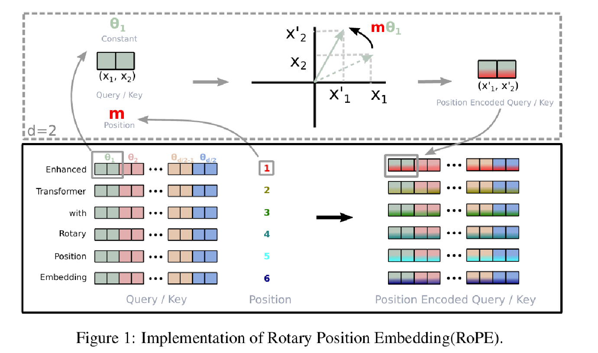

RoPE 的方法论文是 [RoFormer: Enhanced Transformer with Rotary Position Embedding](https://arxiv.org/abs/2104.09864)。旋转位置编码的作者之一苏剑林长期维护[科学空间](https://spaces.ac.cn/archives/8130)，其中有多篇位置编码与 RoPE 的推导文章，值得结合阅读。

本文一方面整理苏剑林相关文章中的核心内容，另一方面补充自己的理解，并结合其他分析对 RoPE 做进一步梳理。

## 背景

不同于 RNN、CNN 等模型，对于 Transformer 来说，位置编码必不可少。纯粹的 Attention 模块无法捕捉输入顺序，也就无法区分不同位置的 token。

为此，大体有两个选择：

1. 想办法将位置信息融入输入，这构成了绝对位置编码的一般做法；
2. 调整 Attention 结构，使它能够分辨不同位置的 token，这构成了相对位置编码的一般做法。

## 绝对位置编码

从形式上看，绝对位置编码是一种相对简单的方案。通常把位置编码直接加到输入中：在输入的第 $k$ 个向量 $x_k$ 中加入只依赖位置编号 $k$ 的位置向量 $p_k$：

$$
x_k \longrightarrow x_k+p_k.
$$

### 训练式

最朴素的绝对位置编码方案，是不额外设计位置函数，而是直接把位置编码作为可训练参数。

例如，最大序列长度为 512，编码维度为 768，就初始化一个 $512\times768$ 的矩阵作为位置向量，并让它随训练过程更新。

这种训练式绝对位置编码的常见缺点是缺少外推性。如果预训练时的最大长度为 512，那么模型原本只学习了前 512 个位置的向量。超过 512 的位置没有训练好的编码；虽然可以随机初始化这些新位置并继续微调，但这不再是直接的长度外推。

### 三角式

三角函数式位置编码通常也称为 Sinusoidal 位置编码，是论文《Attention Is All You Need》提出的显式方案：

$$
\begin{aligned}
p_{k,2i} &= \sin\left(\frac{k}{10000^{2i/d}}\right),\\
p_{k,2i+1} &= \cos\left(\frac{k}{10000^{2i/d}}\right).
\end{aligned}
$$

其中，$p_{k,2i}$ 和 $p_{k,2i+1}$ 分别是位置 $k$ 的编码向量中第 $2i$、$2i+1$ 个分量，$d$ 是位置向量的维度。

这里先看 $k$ 的范围。$k$ 表示序列中的位置编号。假设序列长度为 $L$，通常从 0 开始编号：

$$
k=0,1,2,\ldots,L-1.
$$

例如，输入序列有 5 个 token：

| token | 位置 $k$ |
| --- | ---: |
| 我 | 0 |
| 喜 | 1 |
| 欢 | 2 |
| 学 | 3 |
| 习 | 4 |

再看 $i$ 的范围。$i$ 是正弦—余弦维度对的编号。假设位置编码维度为偶数 $d$，则：

$$
i=0,1,2,\ldots,\frac{d}{2}-1.
$$

每一个 $i$ 对应位置向量中的两个维度：第 $2i$ 维使用 $\sin$，第 $2i+1$ 维使用 $\cos$。因此，$i$ 不是位置编码的直接维度编号，而是正弦—余弦维度对的编号。

例如 $d=8$：

| $i$ | 正弦维度 $2i$ | 余弦维度 $2i+1$ |
| ---: | ---: | ---: |
| 0 | 0 | 1 |
| 1 | 2 | 3 |
| 2 | 4 | 5 |
| 3 | 6 | 7 |

因此，完整的位置编码可以写成：

$$
p_k=
\begin{bmatrix}
\sin\left(k/10000^{0/8}\right)\\
\cos\left(k/10000^{0/8}\right)\\
\sin\left(k/10000^{2/8}\right)\\
\cos\left(k/10000^{2/8}\right)\\
\sin\left(k/10000^{4/8}\right)\\
\cos\left(k/10000^{4/8}\right)\\
\sin\left(k/10000^{6/8}\right)\\
\cos\left(k/10000^{6/8}\right)
\end{bmatrix}.
$$

把幂次化简后，等价于：

$$
p_k=
\begin{bmatrix}
\sin(k)\\
\cos(k)\\
\sin(k/10)\\
\cos(k/10)\\
\sin(k/100)\\
\cos(k/100)\\
\sin(k/1000)\\
\cos(k/1000)
\end{bmatrix}.
$$

可以看到，不同的 $i$ 对应不同的变化频率：

- $i$ 较小时变化快，用于刻画较细粒度的位置差异；
- $i$ 较大时变化慢，用于刻画较大尺度的位置关系。

三角函数式位置编码具有显式的生成规律，因此可以期望它具备一定的外推性。使用它的另一个理由来自三角恒等式：

$$
\sin(\alpha+\beta)=\sin\alpha\cos\beta+\cos\alpha\sin\beta,
$$

$$
\cos(\alpha+\beta)=\cos\alpha\cos\beta-\sin\alpha\sin\beta.
$$

这说明位置 $\alpha+\beta$ 的向量可以表示为位置 $\alpha$ 与位移 $\beta$ 对应分量的组合，从而提供了表达相对位置信息的可能性。

### 递归式

原则上，RNN 不需要额外的位置编码，因为它的递归结构本身就具备学习位置信息的可能性。如果先在输入后接一层 RNN，再接 Transformer，理论上就不必另外加入位置编码。

同理，也可以用递归模型学习一种绝对位置编码：从向量 $p_0$ 出发，通过递归关系

$$
p_{k+1}=f(p_k)
$$

得到各个位置的编码向量。

ICML 2020 论文《Learning to Encode Position for Transformer with Continuous Dynamical Model》进一步使用微分方程建模位置编码，并把该方案称为 FLOATER。函数 $h(p(t),t)$ 可以由神经网络建模，因此这种微分方程也称为神经微分方程。

理论上，基于递归模型的位置编码具有较好的外推性，也比固定三角函数具有更高的灵活性；三角函数式位置编码可以看作 FLOATER 的某个特解。但递归形式会牺牲一定并行性，可能带来速度瓶颈。

## 相对位置编码

相对位置编码不必完整建模每个输入的绝对位置，而是在计算 Attention 时考虑当前位置与被关注位置之间的相对距离。自然语言通常更依赖相对位置关系，因此相对位置编码往往也有较好的表现。

## RoPE

### 出发点

RoPE 的出发点是：**通过绝对位置编码的方式实现相对位置编码**。

具体来说，分别给 Query 和 Key 编入各自的绝对位置 $m$、$n$，但在计算两者内积时，让结果只依赖相对距离 $m-n$ 或 $n-m$。

### 动机

为什么实现 RoPE 时，要给 Query 和 Key 分别编入绝对位置 $m$、$n$？

因为在 Attention 中，Query 和 Key 通常来自不同位置。更准确地说，$q_m$ 表示“第 $m$ 个 token 生成的 Query”，$k_n$ 表示“第 $n$ 个 token 生成的 Key”。位置 $m$ 的 token 要判断位置 $n$ 的 token 对自己有多重要，因此需要计算：

$$
q_m^\top k_n.
$$

这里自然涉及两个位置：

- $m$：当前发起查询的 token 的位置；
- $n$：被查询、被匹配的 token 的位置。

普通线性层生成的 $q_m$、$k_n$ 主要包含 token 的语义信息，并不知道当前 token 位于第几个位置、两个 token 相距多远，也不知道一个 token 在另一个 token 的左边还是右边。

例如，“猫追老鼠”和“老鼠追猫”包含相似的词，但位置关系完全不同。因此，需要把位置信息加入 Query 和 Key。

设加入位置后的 Query 和 Key 为：

$$
\tilde{q}_m=f(q,m),
\qquad
\tilde{k}_n=f(k,n).
$$

原始向量 $q$、$k$ 负责承载语义信息，函数 $f$ 再分别将位置 $m$、$n$ 编入它们。此时，$\tilde{q}_m$ 表示位于位置 $m$ 的 Query，$\tilde{k}_n$ 表示位于位置 $n$ 的 Key。

Attention 真正使用的是 Query 和 Key 的内积，因此希望结果满足：

$$
\left\langle f(q,m),f(k,n)\right\rangle
=g(q,k,m-n).
$$

右侧函数 $g$ 只接收原始语义向量 $q$、$k$ 和相对位置 $m-n$，不再分别依赖 $m$ 与 $n$。

例如：

$$
m=10,n=7,\qquad m-n=3,
$$

$$
m=100,n=97,\qquad m-n=3.
$$

如果满足上面的关系，这两组绝对位置就具有相同的相对位置结构。模型关心的是“Query 在 Key 后面 3 个位置”，而不是它们分别位于第 10、7 或第 100、97 个位置。

“用绝对位置编码实现相对位置编码”可以概括为：先分别对 Query 和 Key 编入绝对位置，再利用二者的内积自然得到相对位置。

可以用钟表指针来类比。假设 Query 根据位置 $m$ 旋转到角度 $m\theta$，Key 根据位置 $n$ 旋转到角度 $n\theta$。每根指针的方向分别包含自己的绝对角度，但两根指针之间的夹角只取决于：

$$
m\theta-n\theta=(m-n)\theta.
$$

所以，单独看每根指针时是绝对位置；比较两根指针时得到相对位置。RoPE 正是利用了这种旋转性质。

### 具体实现

下面看 RoPE 如何构造出这个解。先只考虑二维向量，定义位置 $m$ 对应的旋转矩阵：

$$
R_m=
\begin{bmatrix}
\cos(m\theta) & -\sin(m\theta)\\
\sin(m\theta) & \cos(m\theta)
\end{bmatrix}.
$$

使用旋转矩阵给向量加入位置：

$$
f(q,m)=R_mq,
\qquad
f(k,n)=R_nk.
$$

这表示把 $q$ 旋转 $m\theta$，把 $k$ 旋转 $n\theta$。现在计算二者的内积：

$$
(R_mq)^\top(R_nk).
$$

根据转置规则展开：

$$
(R_mq)^\top(R_nk)=q^\top R_m^\top R_nk.
$$

旋转矩阵有一个重要性质：转置等于反向旋转。

$$
R_m^\top=R_{-m}.
$$

因此，两个旋转矩阵可以合并：

$$
R_m^\top R_n=R_{-m}R_n=R_{n-m}.
$$

于是得到：

$$
\left\langle R_mq,R_nk\right\rangle
=q^\top R_{n-m}k.
$$

最终结果只依赖 $n-m$，不再分别依赖 $m$、$n$，正好满足最初要求：

$$
\left\langle f(q,m),f(k,n)\right\rangle
=g(q,k,n-m).
$$

这里写成 $m-n$ 还是 $n-m$ 取决于内积展开与符号约定；核心结论不变：结果只依赖两个位置之差。

### 实际例子

二维向量也可以看成复数。设向量 $q$ 的模长为 $\lVert q\rVert$、初始辐角为 $\Theta(q)$，位置 $m$ 让它额外旋转 $m\theta$，那么：

$$
\begin{aligned}
f(q,m)
&=R_f(q,m)e^{\mathrm{i}\Theta_f(q,m)}\\
&=\lVert q\rVert e^{\mathrm{i}(\Theta(q)+m\theta)}\\
&=q\,e^{\mathrm{i}m\theta}.
\end{aligned}
$$

复数乘以 $e^{\mathrm{i}m\theta}$ 的几何意义就是旋转 $m\theta$。把它写回实数坐标，正好得到前面的二维旋转矩阵。

实际 Transformer 的维度不是 2，而可能是 128、256 或 4096。RoPE 会把向量每两个维度分成一组：

$$
(q_0,q_1),(q_2,q_3),(q_4,q_5),\ldots
$$

每组二维分量使用不同的旋转频率：

$$
\theta_i=10000^{-2i/d}.
$$

第 $i$ 组在位置 $m$ 的旋转角度为 $m\theta_i$，因此：

$$
\tilde{q}_{m,2i}
=q_{2i}\cos(m\theta_i)-q_{2i+1}\sin(m\theta_i).
$$

$$
\tilde{q}_{m,2i+1}
=q_{2i}\sin(m\theta_i)+q_{2i+1}\cos(m\theta_i).
$$

不同维度对有不同频率：高频维度负责刻画较短距离，低频维度负责刻画较长距离。

这一点与 Sinusoidal 位置编码使用不同频率的思想相似，但应用方式不同：

- Sinusoidal：生成一个位置向量，然后加到 token 表示上；
- RoPE：用正弦、余弦直接旋转 Query 和 Key。

### 不同维度使用不同频率的含义

RoPE 使用二维旋转，而二维旋转一次只能作用在两个坐标上，因此需要把高维向量拆成多个二维平面。

假设某个注意力头中的 Query 维度为 $d=8$：

$$
q=[q_0,q_1,q_2,q_3,q_4,q_5,q_6,q_7].
$$

它始终是一个长度为 8 的向量。RoPE 不会把它变成多个向量，也不会增加或减少维度，而是将 8 个分量两两分组：

| 组编号 $i$ | 该组包含的维度 |
| ---: | --- |
| 0 | 第 0、1 维 |
| 1 | 第 2、3 维 |
| 2 | 第 4、5 维 |
| 3 | 第 6、7 维 |

所以一共有 4 组二维分量，第 $i$ 组就是 $(q_{2i},q_{2i+1})$。这里的“组”只是对向量分量的划分方式。

为什么必须两个维度一组？因为平面旋转需要两个坐标。对于二维向量 $(x,y)$，旋转 $\phi$ 后得到：

$$
\begin{aligned}
x'&=x\cos\phi-y\sin\phi,\\
y'&=x\sin\phi+y\cos\phi.
\end{aligned}
$$

两个新坐标都同时依赖原来的 $x$、$y$，所以二维旋转不能只作用于单独一个分量。

每一组使用不同的旋转速度。第 $i$ 组使用频率：

$$
\theta_i=10000^{-2i/d}.
$$

位置为 $m$ 时，该组的旋转角度为 $m\theta_i$，变换结果仍是：

$$
\tilde{q}_{m,2i}
=q_{2i}\cos(m\theta_i)-q_{2i+1}\sin(m\theta_i).
$$

$$
\tilde{q}_{m,2i+1}
=q_{2i}\sin(m\theta_i)+q_{2i+1}\cos(m\theta_i).
$$

每组包含两个维度，但两个维度共享同一个频率 $\theta_i$。当 $d=8$ 时：

| $i$ | 维度对 | 频率 |
| ---: | --- | --- |
| 0 | $(q_0,q_1)$ | $\theta_0=10000^0=1$ |
| 1 | $(q_2,q_3)$ | $\theta_1=10000^{-2/8}=0.1$ |
| 2 | $(q_4,q_5)$ | $\theta_2=10000^{-4/8}=0.01$ |
| 3 | $(q_6,q_7)$ | $\theta_3=10000^{-6/8}=0.001$ |

位置 $m$ 的整个向量经过变换后，可以把四组结果拼接起来：

$$
\tilde{q}_m=
\begin{bmatrix}
\operatorname{Rotate}(q_0,q_1;m\theta_0)\\
\operatorname{Rotate}(q_2,q_3;m\theta_1)\\
\operatorname{Rotate}(q_4,q_5;m\theta_2)\\
\operatorname{Rotate}(q_6,q_7;m\theta_3)
\end{bmatrix},
$$

其中 $\operatorname{Rotate}(x,y;\phi)$ 表示把二维分量 $(x,y)$ 旋转 $\phi$ 后得到的两个新分量。

结果依然只有 8 个分量，只是被分成 4 个二维平面分别旋转。

如果所有维度都使用同一个频率，例如 $\theta=1$，所有二维组就会以完全相同的速度旋转。虽然各组原始数值不同，但它们携带的位置变化模式是重复的；同时三角函数具有周期性，旋转一圈后某些位置模式会重复。

因此，RoPE 为不同维度对设置不同频率。相同的 token 位置 $m$ 会被编码为多个不同速度的旋转状态，这些频率的组合能够提供更丰富的位置模式。

仍以长度为 8 的向量为例，可以把它想象成四块表盘：

| 表盘 | 维度对 | 每经过一个 token 的转角 |
| --- | --- | ---: |
| 表盘 0 | $(q_0,q_1)$ | $1$ |
| 表盘 1 | $(q_2,q_3)$ | $0.1$ |
| 表盘 2 | $(q_4,q_5)$ | $0.01$ |
| 表盘 3 | $(q_6,q_7)$ | $0.001$ |

当 token 位于 $m=3$ 时，各表盘分别旋转：

$$
3,\quad 0.3,\quad 0.03,\quad 0.003.
$$

最终，位置 3 不是只由一个角度表示，而是由一组角度共同表示。每个角度只作用于对应的两个原有分量，并没有增加向量维度。

### 旋转矩阵是如何定义和设计的

二维旋转矩阵定义为：

$$
R_\phi=
\begin{bmatrix}
\cos\phi & -\sin\phi\\
\sin\phi & \cos\phi
\end{bmatrix}.
$$

这个矩阵会保持任意向量的长度不变，同时让向量方向增加角度 $\phi$。

先看 $x$ 轴单位向量 $e_x=[1,0]^\top$。旋转矩阵把它旋转了 $\phi$：

$$
R_\phi e_x
=
\begin{bmatrix}
\cos\phi & -\sin\phi\\
\sin\phi & \cos\phi
\end{bmatrix}
\begin{bmatrix}1\\0\end{bmatrix}
=
\begin{bmatrix}\cos\phi\\\sin\phi\end{bmatrix}.
$$

结果正是单位圆上角度为 $\phi$ 的点。由于

$$
\cos^2\phi+\sin^2\phi=1,
$$

旋转后的向量长度仍为 1。

再看 $y$ 轴单位向量 $e_y=[0,1]^\top$，它也会被旋转 $\phi$：

$$
R_\phi e_y
=
\begin{bmatrix}
\cos\phi & -\sin\phi\\
\sin\phi & \cos\phi
\end{bmatrix}
\begin{bmatrix}0\\1\end{bmatrix}
=
\begin{bmatrix}-\sin\phi\\\cos\phi\end{bmatrix}.
$$

这说明旋转矩阵的两个列向量，正是原始坐标轴旋转后的结果。RoPE 将这一标准二维旋转按不同频率复制到高维向量的多个二维分量对中，从而完成位置编码。

进一步的理论分析可以参考：

- [Transformer升级之路：6、旋转位置编码的完备性分析](https://spaces.ac.cn/archives/9403)
- [相对位置编码 Transformer 的一个理论缺陷与对策](https://spaces.ac.cn/archives/9105)
- [Transformer升级之路：4、二维位置的旋转式位置编码](https://spaces.ac.cn/archives/8397)

## 参考

- [Su et al.：RoFormer: Enhanced Transformer with Rotary Position Embedding](https://arxiv.org/abs/2104.09864)
- [苏剑林：让研究人员绞尽脑汁的 Transformer 位置编码](https://spaces.ac.cn/archives/8130)
- [苏剑林：Transformer升级之路——博采众长的旋转式位置编码](https://spaces.ac.cn/archives/8265)
- [Vaswani et al.：Attention Is All You Need](https://arxiv.org/abs/1706.03762)
- [Liu et al.：Learning to Encode Position for Transformer with Continuous Dynamical Model](https://arxiv.org/abs/2003.09229)
