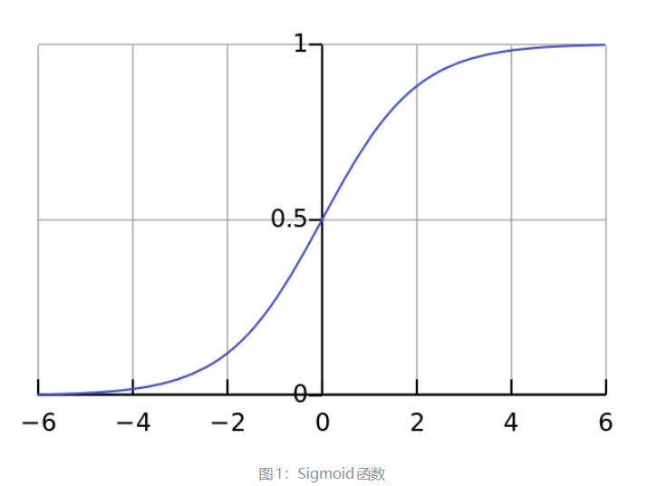

## Sigmoid 函数

Sigmoid 函数是一种 logistic 函数，它将任意值转换到 $(0,1)$ 之间，函数表达式为：

$$
\sigma(x)=\frac{1}{1+e^{-x}}.
$$



Sigmoid 函数的优点包括：

1. 输出位于 $(0,1)$ 之间，输出范围有限，优化相对稳定，可以用作输出层；
2. 它是连续函数，便于求导。

它的缺点也很明显：

1. **饱和性。** 从曲线可以看出，两侧的导数逐渐趋近于 0，容易造成梯度消失；
2. **激活函数的偏移现象。** Sigmoid 的输出值均大于 0，使得输出不是零均值。后一层神经元会接收到上一层非零均值的信号，这会对梯度产生影响；
3. **计算复杂度较高。** Sigmoid 中包含指数运算。

## Softmax 函数

Softmax 是二分类函数 Sigmoid 在多分类上的推广，目的是将多分类结果以概率的形式展现出来。它的数学公式为：

$$
\operatorname{softmax}(x_i)
=\frac{e^{x_i}}{\sum_{j=1}^{N}e^{x_j}}.
$$

例如，原始输出为 $[3,1,-3]$，经过 Softmax 后会被映射为 $(0,1)$ 之间的值，并且所有值之和为 1：

$$
\begin{aligned}
p_1&=\frac{e^3}{e^3+e^1+e^{-3}}\approx 0.88,\\
p_2&=\frac{e^1}{e^3+e^1+e^{-3}}\approx 0.12,\\
p_3&=\frac{e^{-3}}{e^3+e^1+e^{-3}}\approx 0.
\end{aligned}
$$

因此，可以把这些输出理解为概率。在最后选择输出节点时，可以选取概率最大的节点，也就是原始值最大的节点，作为预测目标。

Softmax 先通过指数函数拉大输入向量中元素之间的差异，然后将结果归一化为概率分布。应用到分类问题时，各类别之间的概率差异会更加显著，最大值产生的概率更接近 1，输出分布的形式也更接近目标分布。

## 如何理解 Softmax

可以从三个不同角度理解 Softmax。不同的视角能帮助我们更深入地理解它的应用场景。

### 作为 argmax 的平滑近似

Softmax 可以看作 argmax 的一种平滑近似。argmax 会直接选出最大值，并产生 one-hot 形式的结果；Softmax 则对这种输出做了一定平滑，把 one-hot 输出中最大位置对应的 1，按照输入元素的大小分配到其他位置。

所谓 argmax，就是直接返回输入参数中最大值的索引。例如：

$$
x=[2,7,4],\qquad \max(x)=7,\qquad \operatorname{argmax}(x)=1.
$$

### 作为类别概率分布

Softmax 将输入向量归一化并映射为类别概率分布。这也是深度学习中经常把 Softmax 作为 MLP 最后一层，并配合交叉熵损失函数使用的原因。交叉熵可以衡量两个分布之间的差异。

### 从概率图模型理解

从概率图模型的角度看，Softmax 的形式可以理解为概率无向图上的联合概率。条件最大熵模型与 Softmax 回归模型在形式上是一致的。概率图模型在很大程度上借用了一些热力学系统的理论，因此也可以从物理系统的角度理解 Softmax。

在推理阶段，Softmax 的输出通常用于：

- **采样：** 根据概率分布随机采样下一个 token；
- **贪婪解码：** 选择概率最高的 token，也就是执行 argmax。

## 如何优化 Softmax

### 1. 数值稳定性优化

Softmax 定义为：

$$
\operatorname{softmax}(x_i)
=\frac{e^{x_i}}{\sum_{j=1}^{N}e^{x_j}}.
$$

直接计算可能发生溢出。例如在 FP16 中，较大的 $x_i$ 做指数运算很容易得到 `inf`。

假设输入为：

$$
x=[12,11,10].
$$

数学上：

$$
e^{12}\approx 162754.79.
$$

但 FP16 能表示的最大有限值约为：

$$
65504.
$$

所以在 FP16 中，直接计算 $e^{12}$ 会溢出为 `inf`。后续可能出现 `Inf/Inf`，结果就是 `NaN`。

#### 减去最大值

Softmax 有一个重要性质：所有输入同时减去同一个数，结果不变。对于任意常数 $c$：

$$
\frac{e^{x_i-c}}{\sum_j e^{x_j-c}}
=\frac{e^{x_i}/e^c}{\sum_j e^{x_j}/e^c}
=\frac{e^{x_i}}{\sum_j e^{x_j}}.
$$

因此，取：

$$
m=\max(x)=12.
$$

计算：

$$
x-m=[0,-1,-2],
$$

于是：

$$
e^{x-m}=[1,e^{-1},e^{-2}].
$$

所有指数结果都小于等于 1，不再发生上溢。最终：

$$
\operatorname{softmax}(x)
=\frac{[1,e^{-1},e^{-2}]}{1+e^{-1}+e^{-2}}
\approx[0.6652,0.2447,0.0900].
$$

这就是“减去最大值”的数值稳定 Softmax。最大的指数输入变成 0，所有指数结果都落在 $(0,1]$ 范围内。

工程上一般还会：

- 输入、输出使用 FP16/BF16；
- 最大值归约和求和使用 FP32；
- 计算交叉熵时使用 `log_softmax`，避免先计算 Softmax 再取对数；
- 对全 Mask 行进行特殊处理，防止出现 $-\infty-(-\infty)$ 导致 `NaN`。

#### 工程计算中的数值类型优化

典型计算过程可以理解为：

```python
# logits 原本是 FP16/BF16
x_fp32 = logits.float()

max_value = x_fp32.max(dim=-1, keepdim=True).values
exp_value = torch.exp(x_fp32 - max_value)
sum_value = exp_value.sum(dim=-1, keepdim=True)
prob_fp32 = exp_value / sum_value

# 最终按需要转回 FP16/BF16
prob = prob_fp32.to(logits.dtype)
```

也就是：

```text
FP16/BF16 输入
      ↓
转换成 FP32
      ↓
减最大值、exp、求和、除法
      ↓
得到 FP32 Softmax
      ↓
根据需要转回 FP16/BF16
```

为什么不全程使用 FP32？因为 FP16/BF16：

- 占用显存更少；
- 显存带宽压力更小；
- 矩阵乘法速度通常更高；
- 更适合 Tensor Core；
- 模型权重和激活通常本来就是低精度。

为什么中间过程又要使用 FP32？因为 FP32 的数值范围和有效精度更高，更适合指数和累加操作。

#### log_softmax

Softmax 之后经常需要取对数，例如交叉熵：

$$
L=-\log p_y,
$$

其中 $y$ 是正确类别。最直接的写法是：

```python
prob = softmax(logits)
log_prob = torch.log(prob)
loss = -log_prob[target]
```

问题是，某个概率可能非常小，并在低精度下溢为 0。例如：

$$
x=[0,-100].
$$

理论上，第二个类别的概率约为：

$$
e^{-100}\approx 3.72\times 10^{-44}.
$$

如果先计算 Softmax，这个概率很可能变成 0，然后：

$$
\log(0)=-\infty,
$$

损失也会变成无穷大。但理论上的对数概率其实约为 $-100$，而不是负无穷。

`log_softmax` 直接计算对数概率。根据：

$$
p_i=\frac{e^{x_i}}{\sum_j e^{x_j}},
$$

两边取对数：

$$
\log p_i=x_i-\log\left(\sum_j e^{x_j}\right).
$$

进一步使用稳定的 logsumexp。令 $m=\max_j x_j$，则：

$$
\log p_i
=x_i-\left[m+\log\left(\sum_j e^{x_j-m}\right)\right].
$$

这样不需要先得到一个极小的概率再取对数。对于 $x=[0,-100]$，`log_softmax` 可以直接得到近似结果：

$$
[0,-100].
$$

#### 全 Mask 行处理

在 Attention 中，不允许关注的位置会被 Mask，常见做法是将对应分数设成 $-\infty$。例如某一行：

$$
[2.1,-\infty,0.7,-\infty].
$$

Softmax 后，被 Mask 的位置概率为 0：

$$
[p_1,0,p_3,0].
$$

所谓“全 Mask 行”，是指这一整行没有任何有效位置：

$$
[-\infty,-\infty,-\infty,-\infty].
$$

为什么全 Mask 会产生 `NaN`？稳定 Softmax 的第一步是求最大值：

$$
m=\max(-\infty,-\infty,-\infty)=-\infty.
$$

接下来减去最大值：

$$
x_i-m=-\infty-(-\infty).
$$

在浮点运算中：

$$
-\infty-(-\infty)=\mathrm{NaN},
$$

于是 $e^{\mathrm{NaN}}=\mathrm{NaN}$，后面整行都会变成 `NaN`。一旦 Attention 中出现 `NaN`，后续矩阵乘法、残差连接和网络层都可能被污染。

这主要是数值稳定性优化，不一定会直接提升性能。

常见处理方式是先判断这一行是否至少有一个有效元素：

```python
valid_row = mask.any(dim=-1, keepdim=True)

masked_logits = torch.where(
    mask,
    logits.float(),
    float("-inf"),
)

# 对于全 Mask 行，暂时将最大值设为 0，防止 -inf - (-inf)
row_max = masked_logits.max(dim=-1, keepdim=True).values
row_max = torch.where(valid_row, row_max, 0.0)

exp_value = torch.where(
    mask,
    torch.exp(masked_logits - row_max),
    0.0,
)

denominator = exp_value.sum(dim=-1, keepdim=True)
safe_denominator = torch.where(valid_row, denominator, 1.0)

prob = exp_value / safe_denominator
prob = torch.where(valid_row, prob, 0.0)
```

对于全 Mask 行，最终将它定义为：

$$
[0,0,0,0].
$$

这样后续计算 $PV$ 时，得到的 Attention 输出也是零向量，不会产生 `NaN`。

### 2. 融合算子，减少显存读写

朴素 Softmax 可能被拆成多个 Kernel：

1. 求每一行的最大值；
2. 计算 $\exp(x-\max(x))$；
3. 求和；
4. 除以总和。

如果每一步都把中间结果写回显存，就会产生大量 HBM 读写和 Kernel Launch。更好的实现会把这些步骤融合成一个或少数几个 Kernel：

```text
load logits
→ reduce max
→ exp(logits - max)
→ reduce sum
→ normalize
→ store result
```

Attention 中还可以进一步融合：

```text
scale
→ add mask
→ softmax
→ dropout
```

常见形式包括：

- `scale + mask + softmax`；
- `masked_softmax`；
- `softmax + dropout`；
- $QK^\mathsf{T}+\text{scale}+\text{mask}+\text{softmax}+PV$。

Softmax 的算术量其实不大，很多时候真正的瓶颈是显存带宽和 Kernel 启动开销，因此算子融合往往比减少几次浮点运算更重要。

### 3. Online Softmax

标准稳定 Softmax 需要先求最大值，再求指数和，逻辑上至少需要两次扫描。Online Softmax 可以在一次流式扫描中同时更新最大值和归一化分母。

假设已经处理了前 $j-1$ 个元素：

$$
\begin{aligned}
m_{j-1}&=\max(x_1,\ldots,x_{j-1}),\\
\ell_{j-1}&=\sum_{i=1}^{j-1}e^{x_i-m_{j-1}}.
\end{aligned}
$$

读入新的 $x_j$ 后：

$$
\begin{aligned}
m_j&=\max(m_{j-1},x_j),\\
\ell_j&=\ell_{j-1}e^{m_{j-1}-m_j}+e^{x_j-m_j}.
\end{aligned}
$$

下面看整个公式是如何推导出来的。原始公式为：

$$
\ell_j=\sum_{i=1}^{j}e^{x_i-m_j}.
$$

把新元素单独拿出来：

$$
\ell_j=\sum_{i=1}^{j-1}e^{x_i-m_j}+e^{x_j-m_j}.
$$

对于前面的历史元素，可以写成：

$$
x_i-m_j=(x_i-m_{j-1})+(m_{j-1}-m_j).
$$

所以：

$$
e^{x_i-m_j}
=e^{x_i-m_{j-1}}e^{m_{j-1}-m_j}.
$$

代入原式：

$$
\ell_j
=\sum_{i=1}^{j-1}e^{x_i-m_{j-1}}e^{m_{j-1}-m_j}
+e^{x_j-m_j}.
$$

其中 $e^{m_{j-1}-m_j}$ 对所有历史元素都是相同的，可以提出来：

$$
\ell_j
=e^{m_{j-1}-m_j}\sum_{i=1}^{j-1}e^{x_i-m_{j-1}}
+e^{x_j-m_j}.
$$

而：

$$
\sum_{i=1}^{j-1}e^{x_i-m_{j-1}}=\ell_{j-1}.
$$

于是得到：

$$
\boxed{
\ell_j=\ell_{j-1}e^{m_{j-1}-m_j}+e^{x_j-m_j}
}.
$$

这两个部分分别表示：

- $\ell_{j-1}e^{m_{j-1}-m_j}$：把历史指数和换算到新的最大值基准；
- $e^{x_j-m_j}$：加入当前新元素。

Online Softmax 的价值主要在于：

- 可以分块计算；
- 不需要一次保存完整的一行；
- 可以和后续矩阵乘法融合；
- 它是 FlashAttention 的关键基础之一。

需要注意：对于一个独立的 Softmax 算子，即使一次扫描得到了最大值和分母，输出每个 $p_i$ 时仍然需要访问原始元素，除非这些元素一直保存在寄存器或片上存储中。因此，它真正的优势通常体现在分块融合计算中。

## 总结

Softmax 的优化可以分成三个层面：

1. **数值稳定性：** 减去最大值、使用 FP32 完成归约和累加、直接计算 `log_softmax`，并正确处理全 Mask 行；
2. **访存与调度：** 通过算子融合减少 HBM 读写和 Kernel Launch；
3. **流式与分块：** 使用 Online Softmax 在线更新最大值和归一化分母，为后续融合计算以及 FlashAttention 提供基础。

## 参考

- <https://zhuanlan.zhihu.com/p/356976844>
- <https://zhuanlan.zhihu.com/p/8450501217>
