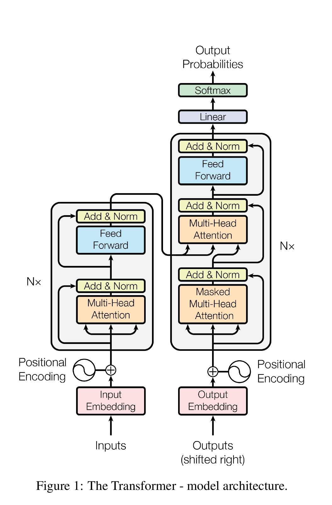
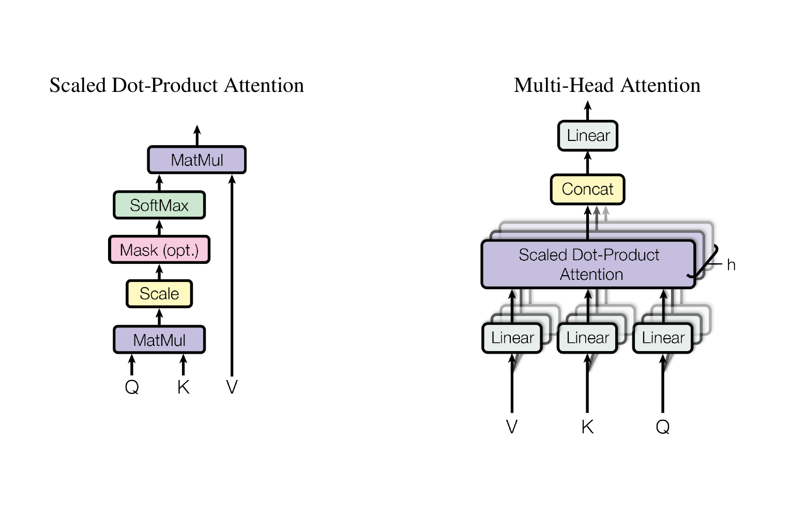

理解 Transformer 时，一个常见困惑是：

> 原始 Transformer 的 Decoder 中明明有两层多头注意力，为什么 GPT、Qwen 等模型被称为 decoder-only，它们的每个网络块里却通常只有一类注意力？

问题的关键在于：**原始 Transformer 的 Decoder 是为 Encoder–Decoder 任务设计的，而现代语言模型中的 decoder-only 是在它的基础上删去 Encoder 和交叉注意力后形成的架构类型。** 两者有关联，但并不是完全相同的结构。

先给出全文结论：

1. 原始 Transformer 是面向机器翻译设计的 Encoder–Decoder 架构。
2. 原始 Decoder 包含因果自注意力和交叉注意力，两者负责不同的信息来源。
3. decoder-only 模型删去了文本 Encoder 与交叉注意力，只保留因果自注意力。
4. 在 decoder-only 模型中，提示词和待生成内容被放进同一个 token 序列，因此模型仍然能够读取输入并继续生成。

## 原始 Transformer：一个完整的 Encoder–Decoder

以英文到中文的翻译为例：

```text
输入：I love cats
输出：我 喜欢 猫
```

原始 Transformer 将任务拆成两步：

- Encoder 读取完整的源语言序列，并把它编码为一组上下文表示。
- Decoder 读取已经生成的目标语言 token，同时查询 Encoder 的输出，预测下一个 token。

下图是论文 *Attention Is All You Need* 中的完整结构。左侧是 Encoder，右侧是 Decoder。



> 图源：Vaswani 等，[Attention Is All You Need](https://arxiv.org/abs/1706.03762)，Figure 1。

设输入序列为

$$
X=(x_1,x_2,\ldots,x_n),
$$

Encoder 将其映射为

$$
Z=\operatorname{Encoder}(X),\qquad Z\in\mathbb{R}^{n\times d_{\text{model}}}.
$$

这里的每一行都对应一个输入位置，但已经融合了整个输入序列的上下文。Decoder 则在已生成目标序列和 $Z$ 的共同条件下逐步生成输出。

## 注意力到底在计算什么

缩放点积注意力的核心公式是

$$
\operatorname{Attention}(Q,K,V)
=\operatorname{softmax}\left(\frac{QK^\top}{\sqrt{d_k}}\right)V.
$$

可以把它理解为三个步骤：

1. 用 $QK^\top$ 计算每个 Query 与各个 Key 的相关性。
2. 除以 $\sqrt{d_k}$ 控制数值尺度，再用 Softmax 得到权重。
3. 按权重对 Value 做加权求和，得到当前位置需要的信息。



> 图源：Vaswani 等，[Attention Is All You Need](https://arxiv.org/abs/1706.03762)，Figure 2。

多头注意力会先使用不同的参数将输入投影到多个子空间：

$$
\operatorname{head}_i
=\operatorname{Attention}(QW_i^Q,KW_i^K,VW_i^V),
$$

然后拼接各个注意力头并做一次线性变换：

$$
\operatorname{MultiHead}(Q,K,V)
=\operatorname{Concat}(\operatorname{head}_1,\ldots,\operatorname{head}_h)W^O.
$$

不同注意力层之间最重要的区别，不在于公式是否改变，而在于 **$Q$、$K$、$V$ 分别来自哪里，以及是否施加因果掩码**。

## Encoder：让每个输入位置看到完整上下文

原始 Transformer 的一个 Encoder Block 主要包含：

1. 多头自注意力；
2. 前馈神经网络；
3. 围绕两个子层的残差连接与 LayerNorm。

在 Encoder 的自注意力中，$Q$、$K$、$V$ 都由同一份输入表示 $X$ 投影得到：

$$
Q=XW^Q,\qquad K=XW^K,\qquad V=XW^V.
$$

因此它叫作 **Self-Attention**。Encoder 通常采用双向可见性，一个位置既可以关注前面的 token，也可以关注后面的 token。这样得到的表示适合完整地理解输入，而不是按顺序生成输出。

关于各个组成部分的细节，可以继续阅读 [self-attention](/ai-fundamentals/self-attention/)、[FeedForward](/ai-fundamentals/feedforward/) 和 [Add&LayerNorm](/ai-fundamentals/add-layernorm/)。

## 原始 Decoder 为什么有两层注意力

原始 Decoder Block 中的两层注意力看起来相似，实际上承担着两个完全不同的任务。

### 第一层：Masked Self-Attention

第一层注意力处理的是右移后的目标序列。训练时即使完整答案已经存在，位置 $t$ 也只能看到 $t$ 之前的 token，不能提前读取未来答案。

设 Decoder 当前的隐藏表示为 $H$，则

$$
Q=HW^Q,\qquad K=HW^K,\qquad V=HW^V.
$$

它仍然是自注意力，但会加入因果掩码 $M$：

$$
\operatorname{CausalAttention}(Q,K,V)
=\operatorname{softmax}\left(\frac{QK^\top}{\sqrt{d_k}}+M\right)V,
$$

其中

$$
M_{ij}=
\begin{cases}
0, & j\le i,\\
-\infty, & j>i.
\end{cases}
$$

这样，第 $i$ 个目标位置只能利用自身及其之前的目标 token。它解决的问题是：

> 根据已经生成的内容，当前应该怎样表示目标端上下文？

### 第二层：Encoder–Decoder Attention

第二层也叫 **Cross-Attention**。此时三组向量不再来自同一个序列：

$$
Q=H_{\text{dec}}W^Q,\qquad K=ZW^K,\qquad V=ZW^V.
$$

Query 来自 Decoder，Key 和 Value 来自 Encoder 的输出 $Z$。因此，这层注意力表达的是：

> Decoder 当前正在生成的内容，应该从输入原文的哪些位置取回信息？

两层注意力可以概括为：

| 模块 | Query 来源 | Key 来源 | Value 来源 | 作用 |
| --- | --- | --- | --- | --- |
| Decoder Self-Attention | Decoder | Decoder | Decoder | 建模已生成的目标内容 |
| Cross-Attention | Decoder | Encoder | Encoder | 从源序列读取相关信息 |

所以，原始 Decoder 中并不是有两层功能重复的自注意力。第一层在目标序列内部建模，第二层连接目标序列和源序列。

## 为什么 Encoder 输出连接到 Decoder 的中间

Encoder 输出并不是 Decoder 的普通输入 token。Decoder 的普通输入是**右移后的目标序列**，而 Encoder 输出更像一块外部记忆。

信息流可以理解为：

1. Decoder 先通过因果自注意力整理已经生成的目标上下文。
2. 再用整理后的状态作为 Query，去 Encoder 的结果中检索相关信息。
3. 检索结果经过前馈网络处理后，用于预测下一个 token。

这个区别从矩阵形状上会更加直观。设源序列长度为 $n$，目标序列长度为 $m$。

Decoder 自注意力的分数矩阵为

$$
Q_{\text{dec}}K_{\text{dec}}^\top\in\mathbb{R}^{m\times m},
$$

它描述目标位置之间的关系，并使用下三角因果掩码。

交叉注意力的分数矩阵为

$$
Q_{\text{dec}}K_{\text{enc}}^\top\in\mathbb{R}^{m\times n},
$$

每一行对应一个目标位置，每一列对应一个源位置。由于翻译开始前完整原文已经给出，交叉注意力不需要因果掩码；如果源序列包含补齐 token，则只需使用 Padding Mask。

## 从原始 Transformer 到 decoder-only

原始 Transformer 的结构可以简化为：

```text
输入文本 → Encoder → 上下文表示
                         ↓
目标前缀 → Decoder → 下一个 token
```

而 decoder-only 模型删除了 Encoder 和 Cross-Attention，把提示词与回答统一放进一个序列：

```text
[提示词 token][回答 token]
```

整个序列只经过重复堆叠的 decoder-only Block。每个 Block 通常包含：

1. 因果自注意力；
2. 前馈网络；
3. 归一化与残差连接。

此时，模型用统一的下一个 token 预测目标训练：

$$
P(x_1,x_2,\ldots,x_T)
=\prod_{t=1}^{T}P(x_t\mid x_{<t}).
$$

推理时，提示词位于生成内容之前。回答位置虽然不能看未来，却可以通过因果自注意力看到前面的全部提示词。因此，**没有独立的 Encoder 并不等于模型看不到或无法理解输入**。

## 为什么 decoder-only 适合现代大语言模型

decoder-only 的流行并不意味着 Encoder–Decoder 没有价值，而是它特别适合通用的自回归语言建模。

### 统一训练目标

无论是续写、问答、摘要还是代码生成，都可以转化为“根据前文预测下一个 token”。模型不必为不同任务更换基本训练目标。

### 统一输入与输出

指令、上下文、示例和回答都能编码到同一个序列中。信息通过同一种因果自注意力机制传递，架构和数据组织都更加统一。

### 与生成过程天然一致

训练目标和推理过程都是从左到右预测下一个 token，适合持续扩展上下文和模型规模。

需要注意的是，`decoder-only` 描述的是一种核心文本架构。多模态系统还可能包含视觉编码器、音频编码器、投影层或其他模块，不能因为语言主干采用 decoder-only，就把整个系统简单等同于纯文本 Decoder。

## 现代 Decoder Block 还改变了什么

现代大模型保留了“因果自注意力 + 前馈网络”这一核心，但实现细节通常已经不同于 2017 年的原始 Transformer，例如：

- 使用 Pre-Norm，而不是原论文中的 Post-Norm；
- 使用 RMSNorm 替代 LayerNorm；
- 使用 RoPE 等相对位置信息方案；
- 使用 SwiGLU 等门控前馈网络；
- 使用 MQA 或 GQA 降低推理时的 KV Cache 开销；
- 使用 MoE、滑动窗口注意力或稀疏注意力扩展模型容量与上下文。

这些变化改进了训练稳定性、表达能力或推理效率，但没有改变 decoder-only 的基本逻辑：**通过带因果约束的注意力，从已有 token 预测下一个 token**。其中 RoPE 的原理可参考 [旋转位置编码](/ai-fundamentals/rotary-position-embedding/)。

## Decoder 不等于 decode

这两个词很接近，却属于不同层面：

| 术语 | 含义 |
| --- | --- |
| Decoder | 模型架构中的组成部分 |
| decoder-only | 只使用 Decoder 风格主干的架构类型 |
| decode | 自回归推理中逐 token 生成的运行阶段 |
| KV Cache | 在生成过程中复用历史 Key、Value 的缓存机制 |

decoder-only 模型的推理通常分为两个阶段：

1. **Prefill**：并行处理完整提示词，并建立各层的 KV Cache。
2. **Decode**：一次生成一个新 token，并把新产生的 Key、Value 追加到缓存。

原始 Encoder–Decoder 模型也可以使用缓存：Decoder 自注意力的历史 Key、Value 可以复用；交叉注意力中由 Encoder 输出计算出的 Key、Value 在一次生成过程中保持不变，同样可以预先计算并重复使用。

## 常见误区

### 误区一：没有 Encoder 就无法理解输入

decoder-only 模型把输入放在生成内容之前，后续位置可以通过因果自注意力读取全部输入。独立 Encoder 被删除了，输入信息本身并没有消失。

### 误区二：现代 decoder-only 就是原始 Decoder 原封不动地保留下来

现代结构通常删除了 Cross-Attention，并对归一化、位置编码、前馈网络和注意力实现做了大量修改。

### 误区三：Encoder 输出是 Decoder 的普通输入

Decoder 的普通输入是右移后的目标 token；Encoder 输出作为外部记忆，为 Cross-Attention 提供 Key 和 Value。

### 误区四：原始 Decoder 的两层注意力都是 Self-Attention

只有第一层是目标序列内部的因果自注意力。第二层的 Query 来自 Decoder，而 Key、Value 来自 Encoder，因此是交叉注意力。

### 误区五：Decoder 和 decode 是同一个概念

Decoder 是架构，decode 是推理阶段。一个描述模型“长什么样”，另一个描述模型“怎样运行”。

## 总结

可以用三句话记住 Transformer 的结构演变：

1. **原始 Encoder**：读取完整源序列，让每个输入位置融合上下文。
2. **原始 Decoder**：先建模目标历史，再通过 Cross-Attention 查询源序列，最后预测下一个 token。
3. **现代 decoder-only**：把提示词和回答放在同一序列中，只用因果自注意力同时完成上下文读取与生成。

原始结构的两种注意力也可以浓缩为：

$$
\boxed{\text{Self-Attention：在同一序列内部建立联系}}
$$

$$
\boxed{\text{Cross-Attention：用一个序列查询另一个序列}}
$$

理解 $Q$、$K$、$V$ 的来源以及掩码的作用后，Encoder、原始 Decoder 和 decoder-only 之间的区别就会变得清晰。

## 参考资料

- Vaswani, A. et al. [Attention Is All You Need](https://arxiv.org/abs/1706.03762), 2017.
