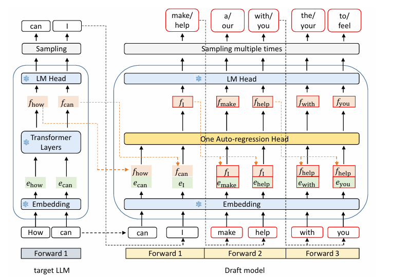
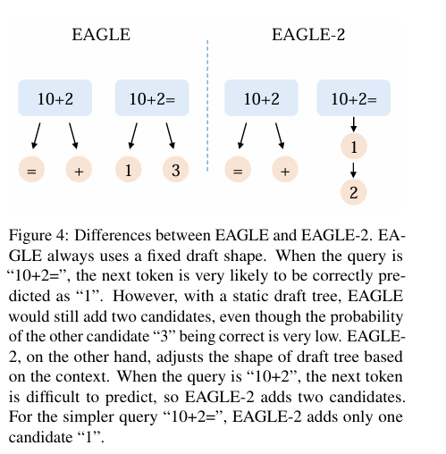
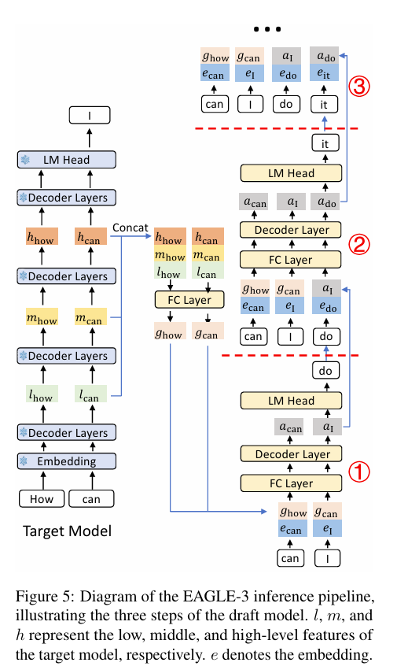
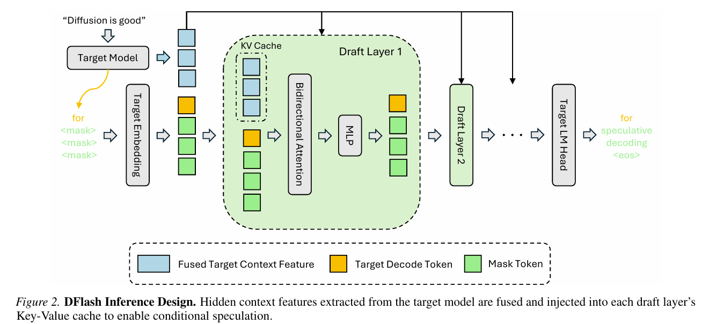
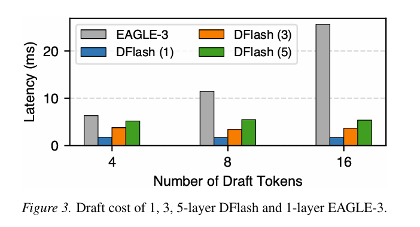

> DFlash 比 EAGLE-3 更快的核心原因，不是“模型更小”，而是它把草稿生成从跨 token 的自回归串行过程，改造成单次前向中的块级并行预测。

投机解码（Speculative Decoding）把一次生成拆成两个阶段：先由轻量草稿模型提出多个候选 token，再由目标大模型并行验证。只要采用严格的接受规则，最终输出分布就可以与目标模型直接自回归解码保持一致。

这套方法的上限不仅取决于目标模型一次能验证多少 token，也取决于**草稿本身生成得有多快**。EAGLE 系列持续提高草稿质量和接受长度，但直到 EAGLE-3，其草稿阶段仍然保留明显的自回归依赖。DFlash 的变化更根本：它用轻量级块扩散模型一次并行预测整个草稿块。

## 从 EAGLE 到 EAGLE-3

理解 DFlash 的优势，首先需要看清 EAGLE 系列逐步解决了什么问题。

### EAGLE：在特征空间自回归

原始 EAGLE 不让草稿模型仅根据 token 做预测，而是复用目标模型靠近输出端的隐藏特征，并将其与错开一个时间步的 token embedding 一起输入草稿模型。草稿模型在特征空间中自回归地预测下一步特征，再通过目标模型的 LM Head 得到 token 分布。

*图 1：EAGLE 的目标模型与草稿模型数据流。图源：[EAGLE 论文](https://arxiv.org/abs/2401.15077)。*

这种设计利用了目标模型已经计算出的语义信息，通常比独立的小语言模型更容易生成高质量草稿。不过，草稿 token 仍然需要一步接一步地产生，并按预设的静态草稿树扩展候选。

### EAGLE-2：从静态树变成动态树

EAGLE-2 沿用 EAGLE 的草稿模型，重点改造草稿树。静态树对所有上下文使用同一种宽度和深度，但不同上下文的预测难度并不相同：有些位置几乎只有一个高概率答案，有些位置则需要保留更多分支。

*图 2：EAGLE 使用固定草稿树，EAGLE-2 根据草稿模型置信度动态分配候选。图源：[EAGLE-2 论文](https://arxiv.org/abs/2406.16858)。*

因此，EAGLE-2 使用草稿模型的置信度近似 token 接受率，把计算预算动态分配给更有希望的分支。这减少了无效候选，但没有改变草稿 token 之间的自回归依赖。

### EAGLE-3：多层特征融合与直接 token 预测

EAGLE-3 对模型结构做了两项重要调整：

1. 不再要求草稿模型拟合目标模型的下一步隐藏特征，而是直接优化 token 预测。
2. 不再只依赖靠近输出端的一层特征，而是融合目标模型的低层、中层和高层特征。

*图 3：EAGLE-3 融合目标模型不同层次的隐藏特征，并在草稿模型中逐步生成候选。图源：[EAGLE-3 论文](https://arxiv.org/abs/2503.01840)。*

这些改动提升了草稿质量，也让草稿模型能够从更多训练数据中获益。但在推理阶段，EAGLE-3 仍然需要把上一步草稿结果反馈给下一步：要产生长度为 \(K\) 的草稿路径，关键路径上仍存在约 \(K\) 次顺序相关的草稿计算。

## DFlash 做了什么改变

DFlash 使用轻量级 block diffusion 模型生成草稿。它不再沿着一条路径从左到右逐 token 解码，而是先为一个固定长度的草稿块放置 mask token，再在双向注意力中并行恢复整个块。

*图 4：DFlash 将目标模型上下文特征注入各个草稿层，并对一个 token 块进行并行预测。图源：[DFlash 论文](https://arxiv.org/abs/2602.06036)。*

这个结构有三个关键点：

- **块级并行预测**：同一草稿块中的多个位置在一次前向计算中同时产生，不再形成跨 token 的串行链。
- **双向注意力**：草稿块内部的 mask 位置可以相互建模，适合并行恢复多个 token，而不是使用标准因果注意力逐个向右生成。
- **KV injection**：目标模型提取出的上下文隐藏特征被注入每一层草稿网络，并预先形成可复用的 Key/Value，使草稿模型获得目标模型的上下文知识。

DFlash 可以使用多层 Transformer 来增强草稿能力。层数增加会增加单次前向的计算量，但这些层处理的是整块 token；它增加的是网络深度，而不是 token 之间必须依次等待的串行步数。

## 为什么更深的 DFlash 仍然更快

乍看之下，五层 DFlash 应该比单层 EAGLE-3 更慢。这个直觉忽略了两类不同的“深度”：

- EAGLE-3 的主要延迟来自**草稿步深度**：下一个 token 依赖上一个 token 的结果。
- DFlash 的主要延迟来自**网络层深度**：每层都在 GPU 上并行处理整个 token 块。

二者对硬件的影响不同。

### 1. 串行草稿步变成一次块级前向

EAGLE-3 每增加一个草稿 token，都需要完成一次依赖前一步结果的草稿计算。即使单步模型只有一层，这些步骤也无法沿时间维度完全并行。

DFlash 则把 \(K\) 个草稿位置组织成一个张量，在一次模型调用中并行处理。草稿长度从 4 增加到 16 时，矩阵形状会变大，但关键路径没有增加 12 次自回归迭代。

### 2. 减少重复调度和同步

自回归草稿的每一步通常都伴随新的算子调度、KV Cache 更新以及下一步开始前的数据依赖同步。具体实现未必需要把数据搬回 CPU，但 GPU 仍要等待上一步结果才能继续。

DFlash 把更多工作合并到一次连续的草稿前向过程中，减少了跨草稿步的调度与同步开销，也更容易形成尺寸更大、利用率更高的矩阵计算。

### 3. LM Head 从逐步调用变成块级调用

EAGLE-3 在每个自回归草稿步都需要通过 LM Head 得到词表 logits，才能选出 token 并进入下一步。词表投影涉及隐藏状态与大词表矩阵的乘法，重复执行会形成不可忽略的成本。

DFlash 在一次块级前向结束时，对所有草稿位置批量产生 logits。它并不是只计算一个位置的词表，而是把多个位置的词表投影组织成一次批量计算，避免逐 token 重复启动 LM Head。

### 4. 更强的草稿模型还能提高接受率

更深的 DFlash 具有更强的拟合能力，但“层数更多”并不自动等于“预测一定更准”。真正需要衡量的是：增加的草稿成本，能否换来更高的接受率和更长的平均接受长度。

DFlash 的多层结构、双向块建模和目标特征注入共同提高了草稿质量。草稿被接受得越多，目标模型每次验证所摊销的生成成本就越低。

## 论文中的草稿延迟对比

*图 5：生成 4、8、16 个草稿 token 时，EAGLE-3 与 1/3/5 层 DFlash 的草稿延迟。图源：[DFlash 论文](https://arxiv.org/abs/2602.06036)。*

图中的趋势比绝对数值更重要：

- EAGLE-3 的草稿延迟随 token 数量明显上升，从约 6 ms 增长到 20 ms 以上。
- DFlash 的延迟随草稿长度变化很小，因为多个位置在同一次前向中并行计算。
- 即使是五层 DFlash，在图示设置下生成 16 个草稿 token 的成本仍显著低于单层 EAGLE-3。

这是一个**草稿阶段微基准**，不能直接等同于端到端生成速度。实际收益还会受到目标模型大小、验证成本、接受率、batch size、硬件和推理框架实现的影响。不过，它直接说明了 DFlash 的核心优势：草稿长度增加时，延迟不再近似线性增长。

## 一张表总结差异

| 维度 | EAGLE-3 | DFlash |
| --- | --- | --- |
| 草稿生成方式 | 自回归、逐步反馈 | 块扩散、并行预测 |
| 草稿网络 | 单层 Transformer Decoder | 可配置多层 Transformer |
| 注意力形式 | 因果/树形依赖 | 草稿块内双向注意力 |
| 目标模型信息 | 低、中、高层特征融合 | 上下文特征逐层 KV injection |
| 生成 \(K\) 个草稿 token | 关键路径包含多次顺序草稿步 | 单次块级草稿前向 |
| LM Head | 随自回归步骤重复调用 | 对整个草稿块批量调用 |
| 草稿长度增大时的延迟 | 通常明显增长 | 在硬件容量范围内增长较缓 |

## 结论

DFlash 比 EAGLE-3 更快，根本原因可以概括为一句话：

> EAGLE-3 优化了“每一步怎样猜得更准”，DFlash 则进一步改变了“这些步骤是否必须依次执行”。

EAGLE-3 通过直接 token 预测和多层特征融合提高了草稿质量，但其推理关键路径仍然是自回归的。DFlash 用块扩散把多个草稿 token 放进同一次前向中并行生成，以更深但更适合 GPU 的计算，替代跨 token 的串行等待。

因此，DFlash 的五层网络并不必然比 EAGLE-3 的单层网络慢。只要并行计算增加的成本小于被消除的自回归迭代、重复调度和逐步词表投影成本，它就能同时获得更强的草稿能力和更低的草稿延迟。

## 参考资料

- [EAGLE: Speculative Sampling Requires Rethinking Feature Uncertainty](https://arxiv.org/abs/2401.15077)
- [EAGLE-2: Faster Inference of Language Models with Dynamic Draft Trees](https://arxiv.org/abs/2406.16858)
- [EAGLE-3: Scaling up Inference Acceleration of Large Language Models via Training-Time Test](https://arxiv.org/abs/2503.01840)
- [DFlash: Block Diffusion for Flash Speculative Decoding](https://arxiv.org/abs/2602.06036)
- [DFlash 官方实现](https://github.com/z-lab/dflash)
