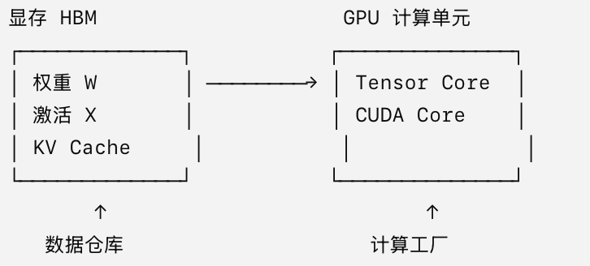
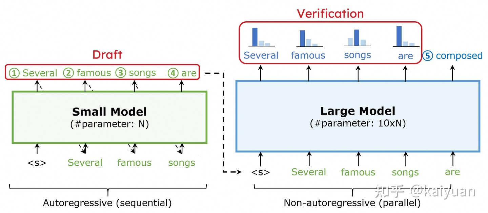
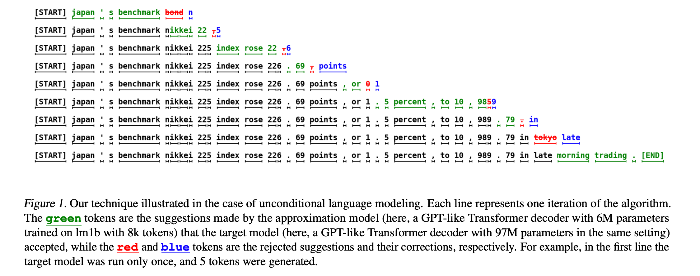
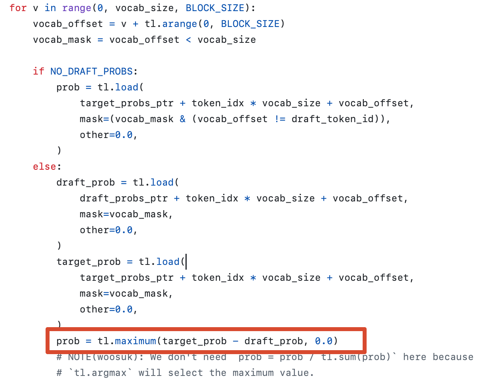
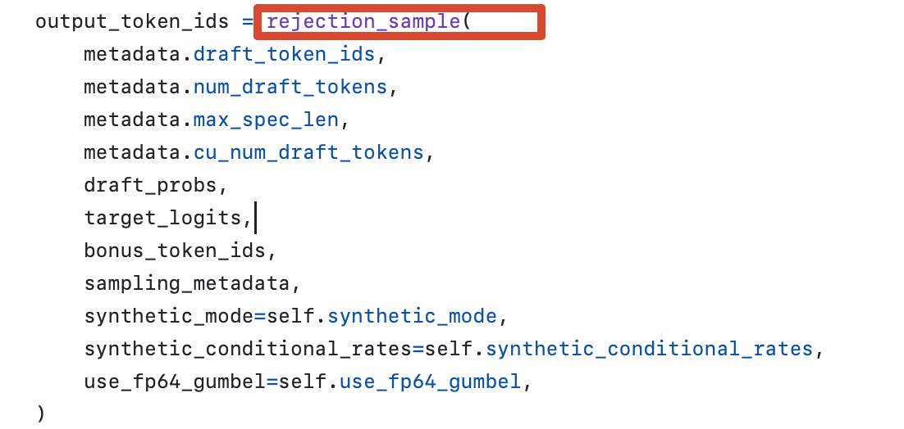



最经典的投机解码技术来源于google 2023年提出的 Fast Inference from Transformers via Speculative Decoding [https://arxiv.org/pdf/2211.17192](https://arxiv.org/pdf/2211.17192)

这篇文章确定了投机解码的基本理念，核心的拒绝采样机制。并开启了近3年狂热的投机推理技术演进浪潮。

本文将围绕该文章的技术原理，拒绝采样细节进行展开介绍，并引出一些投机推理的技术演进路线和使用。


## 问题背景-模型decode为什么慢

自回归式推理决定了模型decode阶段很慢。


我们常用的普通的大模型是自回归式的推理来生成token。 所谓自回归式的，就是下一个 token 必须等上一个 token 确定之后才能生成。 这种生成称为自回归解码-Autoregressive Decoding

假设输入：中国的首都是

大模型首先计算下一个 token 的概率分布：

根据概率采样，大概率采样出北京。 然后当前字段为中国的首都是北京

进一步需要计算下一个token的概率，假如下一个token是句号：。  得到 中国的首都是北京 。

整个生成过程实际上是    x1 → x2 → x3 → x4 → ...

所以如果生成 100 个 token，通常就意味着需要经历大约 100 个串行 Decode Step


### 自回归式推理与memory bound的关系

Memory Bound 是指数据从显存搬到计算单元的速度，跟不上 GPU 做计算的速度

也就是说，GPU 的计算单元本来还能继续算，但因为下一批权重、激活、KV Cache 还没有从 HBM 搬过来，只能等数据



自回归式推理天然带来memory bound ，因为模型在prefill结束，进入decode阶段时，

每生成 1 个 token，都要把几乎整套模型权重重新从 HBM 读一遍，但只做很少的一次计算。 （上述说的是在batch不大的场景下，即使是在大 batch场景下 batch 64，128,   投机解码也能一定程度上加速推理）

## Speculative Decoding 核心理念


每次为了生成一个 token 都读取大量权重很贵， 我们希望权重读取一次，但是一次处理多个 token来解决问题

但问题是自回归式的推理使得未来token无法获取。

为了解决上述问题 ， 经典的Speculative Decoding 引入一个计算开销远小于目标模型的 Draft Model，让它先连续生成多个候选 token再让大模型一次性检查这些猜测是否正确

这个小模型通常叫做 Draft Model（草稿模型），真正负责保证最终输出分布正确的大模型叫 Target Model（目标模型）

下图表达了这个理念



由草稿模型基于&lt;s&gt; 快速自回归推理出四个token

由目标大模型 并行验证这四个token是否通过。

对于第一个token，其使用&lt;s&gt; 进行推理，得到Several

同时对于第二个token 使用&lt;s&gt; 和来自草稿模型的Several 进行推理，得到famous

同时对于第三个 token使用&lt;s&gt;和来自草稿模型的Several, famous 进行推理，得到songs


没有投机推理之前，大模型只能根据&lt;s&gt;进行一步推理，而有投机推理以后，可以通过来自草稿模型的结果并行推理多步。  如果持续到推理验证出songs时，目标模型验证草稿模型的推理结果都是对的。而基于songs验证不应该出现are。 最后目标模型就会采纳 Serveal famous songs 这三个token的推理结果。因为草稿模型基于songs后推理的结果出错了，所以后续的结果将不再接受。


我们可以再看一下来自Speculative decoding 原文的示例



在该示例中，绿色字体的token是被草稿模型推理，经过目标模型验证后的token

红色字体的token是目标模型验证不通过的token

蓝色字体是投机解码这套理论在目标模型验证不正确后，根据实际情况补充采样的token。

## 关于拒绝采样

在上述讨论中，我们应注意到，草稿模型的推理结果在经过模板大模型验证后，有可能被目标模型拒绝。

在目标模型拒绝草稿模型的结果时会采取先拒绝，后采样的方式来采样出真正准确的token。这个动作称为拒绝采样。


这里我们抽象分析一下为什么拒绝后还可以采样出一个新的token?（蓝色token作为准确的token，也可以称为bonus token, clean token）


想一想目标模型验证草稿模型时，是基于前置token+草稿模型生成的token 这个结果进行验证

基于前置token，目标模型可以自己decode出准确的token, 如果目标模型推理出的token和草稿模型生成的token不一致，当然可以拒绝掉草稿模型的token，但是目标模型推理的token也是我们实际想要的准确的token，因此每次目标模型进行验证，即使草稿模型的结果全被拒绝掉，也保底会有1个准确token的收益，这个收益经验证草稿模型结果失败时采样获取。


但是尤其要注意的是，初次了解投机推理的同学会容易理解成，当发生拒绝采样时，我们直接使用目标模型推理的准确结果作为 bonus token 就可以了，这种想法是错误的！！！

实际上，发生拒绝采样时，我们不能重新按照大模型完整的概率分布采样，因为其中一部分概率已经被 Draft 使用过了。我们只应该从“大模型还没有被 Draft 覆盖的那部分概率”中采样。这部分剩余概率归一化以后，就叫做残差概率分布。采样出的token作为bonus token来保证保底的decode 收益。 接下来我们会花一定篇幅解释原因，因为这是投机推理基本理念中最重要的部分。

### 如何判断草稿模型的token是否应该被目标模型接受

为了理解拒绝采样，我们应先讨论草稿模型的推理结果是如何经过目标模型的验证的。

人们可能会想当然的认为，草稿模型推理出的token，和目标模型不一致，那就拒绝这个结果。反之一致则验证通过。


但是我们要知道，目标模型decode时，往往不是取概率最高的token进行输出，它是基于自己整个网络层最后一层网络（lm head层） 对整个词表进行概率计算，获得一个整个词表的概率分布。然后基于这个概率进行采样，得到的decode结果。 也就是说在部署温度不为0时，模型的推理结果每次并不一致。回复的每个token都是基于前置token生成的概率分布的采样。


假设 Draft Model 生成：Beijing

我们觉得应该接受吗？  一种直觉的方案是： 看看目标大模型是不是也觉得 Beijing 概率很高。

但马上出现一个问题：Beijing的概率多高算高？

例如草稿模型认为 Beijing 有 0.8的概率选中  目标模型认为Beijing 有 0.5的概率选中。 此时我们应该拒绝草稿模型的推理结果还是通过它的结果？


此时我们应意识到Speculative Decoding  并不是要求Draft model 找到 Target model的 Top-1的token。

而是要求：Speculative Decoding 这套方法最终产生 token 的概率分布，必须和 Target Model 原本的概率分布完全一致。 此时无论我们如何采样，结果都和原本的目标模型概率分布保持一致。那么这就达成了无损的推理加速。

所谓无损，是指基于Speculative Decoding采样得到的推理结果符合原本目标模型的概率分布。


下面我们就具体以一个示例，来看看Speculative Decoding如何通过拒绝采样来实现无损推理概率分布

### 拒绝采样示例

假设词表里现在只有两个 token：A,B  由于只有两个token，所以无论是什么模型，这两个token的概率分布加一起为1

假设Draft Model 的概率分布是：

这里我们也可以记作   $q=(0.7,0.3)$


Target Model 的概率分布是：

这里记作$p=(0.4,0.6)$


通过这两个概率分布我们可以看出，草稿模型过度偏好A

如果 Draft 生成 A 以后，我们全部无条件接受，那么 A 最终出现的概率就会接近：70%

而 Target 原本只希望：40% 显然不对。

所以：Draft 提出的 token 不能全部无条件接受，我们必须有概率地拒绝一部分 Draft Token。实际采样的时候，自然分为两种场景，一种是接受Draft token的采样结果。 另一种是拒绝Draft token的采样结果，再重新采样。

#### 接受Draft token的场景

经典 Speculative Sampling 定义接受概率：

$$
P(\operatorname{Accept}\mid x)=\min\left(1,\frac{p(x)}{q(x)}\right)
$$

其中$p(x)$代表目标模型对于token x的概率 ， $q(x)$代表草稿模型对于token x的概率 。下面我们使用公式结合示例来讨论一下。


对于token A， $q(A) = 0.7$ ,  $p(A) = 0.4$   因此接受的概率

$$
P(\operatorname{Accept}\mid A)=\frac{0.4}{0.7}\approx 0.571
$$

也就是说草稿模型有70%的概率采样出A,目标模型只有57.1%的概率会接受。 那么我们使用草稿模型采样出A，目标模型接受A这个结果的概率就是 0.7 × 0.571 = 0.4 刚好等于目标模型自己对A采样的概率


对于tokenB,  $q(B) = 0.3$ , $p(B) = 0.6$  此时 $p(B) / q(B) = 0.6 / 0.3 = 2$ 但是接受概率不能超过1， 所以我们直接取1 （这也是为什么公式里有$\min(1, xxx)$）

也就是说只要草稿模型采样出B， 目标模型就可以接受。所以目标模型接受B这个结果的概率就是 0.3 乘 1 = 0.3


此时我们发现，目标模型接受草稿模型的推理结果时，草稿模型的推理结果共有70%的概率可以直接被拿来作为答案（40%+30%）

#### 拒绝Draft token的场景

拒绝何时发生？拒绝发生在草稿模型提出A，并且目标模型不接受A时。 此时概率为$q(A)$ × （1- $P(Accept \mid A)$） = 0.7 乘 （1-0.4/0.7） = 0.3

发生拒绝时，采样规则遵循一个残差分布采样。 经典 Speculative Sampling 使用：

$$
p_{\mathrm{residual}}(x)\propto\max(0,p(x)-q(x))
$$

完整写法是：

$$
p_{\mathrm{residual}}(x)=\frac{\max(0,p(x)-q(x))}{\sum_y\max(0,p(y)-q(y))}
$$

其中分母表示 把整个词表里所有“Target 还缺的概率质量”加起来。

它有两个作用：它等于这一轮的总体 Reject 概率；用它做除法，可以把剩余概率重新归一化，使总和变成 1。


在我们的例子中

对于A, $P(A) - q(A) = 0.4 - 0.7 = -0.3$ 。 所以取 $\max(0, -0.3) = 0$。 $0/0.3 = 0$

对于B, $P(B) - q(B) = 0.6 - 0.3 = 0.3$  。 所以取 $\max(0, p - q) = (0,0.3)$ 。 $0.3 / 0.3 = 1$


根据残差分布采样结果，发生拒绝时我们100%概率采样出 B 。 而发生拒绝的概率是30%，


现在我们来看一下总概率。 在接受Draft token 的场景下，共有40%概率采样出A, 30%概率采样出B

在拒绝Draft token的场景下，共有30%的概率采样出B。 因此对于A,B 在Speculative decoding下，采样概率分别是 A 40%, B 60%, 这个概率和 目标模型的原始分布概率一致。


#### 反例-发生拒绝时直接用目标模型概率分布采样


我们可以尝试一下一旦发生拒绝，不采用投机推理的残差概率分布采样，而是使用目标模型原始的概率分布直接采样结果。观察会发生什么。


还是这个例子。

Target：

$p=(0.4,0.6)$


接受Draft token 场景 对于A,B 采样概率 $(0.4,0.3)$


拒绝概率为0.3 。  如果 拒绝后直接重新从目标模型的概率分布进行采样：

$p=(0.4,0.6)$

那么结果为  发生拒绝的概率 × $p=(0.4,0.6)$

也就是$p(A) = 0.12$ $p(B)= 0.18$

加上原本接受的$p(A)$概率0.4   和$p(B)$概率0.3


总的$p(A)$ 概率为  0.4 + 0.12 =0.52

总的$p(B)$ 概率为 0.3 + 0.18 =0.48


$p(A) + p(B) = 1$ 但是这个概率分布已经偏离了原始的目标模型的概率分布了，也就是采样结果不再是无损的。


#### 拒绝采样概率合理性证明

google的文章在附录上做了详细的拒绝采样的残差概率分布设计上的合理性证明，证明了这样设计能够保证发生拒绝时，使用残差分布的概率进行采样能够保证和原始的目标模型的概率分布一致。

**A. Appendix**

**A.1. Correctness of Speculative Sampling**

We will now show that, for any distributions $p(x)$ and $q(x)$, the tokens sampled via *speculative sampling* from $p(x)$ and $q(x)$ are distributed identically to those sampled from $p(x)$ alone. Let $\beta$ be the acceptance probability (Definition 3.1).

Note that as

$$
p'(x)=\operatorname{norm}(\max(0,p(x)-q(x)))=\frac{p(x)-\min(q(x),p(x))}{\sum_{x'}(p(x')-\min(q(x'),p(x')))}=\frac{p(x)-\min(q(x),p(x))}{1-\beta},
$$

the normalizing constant for the adjusted distribution $p'(x)$ is $1-\beta$, where the last equation follows immediately from Lemma 3.3 and Theorem 3.5.

Now:

$$
P(x=x')=P(\text{guess accepted},x=x')+P(\text{guess rejected},x=x')
$$

Where:

$$
P(\text{guess accepted},x=x')=q(x')\min\left(1,\frac{p(x')}{q(x')}\right)=\min(q(x'),p(x'))
$$

And:

$$
P(\text{guess rejected},x=x')=(1-\beta)p'(x')=p(x')-\min(q(x'),p(x'))
$$

Overall:

$$
P(x=x')=\min(p(x'),q(x'))+p(x')-\min(p(x'),q(x'))=p(x').
$$

As desired. □

#### vllm中拒绝采样源码

[https://github.com/vllm-project/vllm/blob/main/vllm/v1/sample/rejection_sampler.py](https://github.com/vllm-project/vllm/blob/main/vllm/v1/sample/rejection_sampler.py)

下图红框就是在算拒绝采样时的残差概率分布



下图红框是在进行采样



下面贴一份等价的简化

```Python
# p: Target Model probability distribution
# q: Draft Model probability distribution
# draft_token: token proposed by Draft Model

draft_prob = q[draft_token]
target_prob = p[draft_token]

# 1. Rejection sampling
r = random.uniform(0, 1)

accept = (
    draft_prob > 0
    and r <= target_prob / draft_prob
)

if accept:
    output_token = draft_token

else:
    # 2. Compute residual probability mass
    residual = maximum(p - q, 0)

    # 3. Normalize residual distribution
    residual = residual / residual.sum()

    # 4. Sample a recovered token
    output_token = sample(residual)
```

## 基于vllm使用投机解码

当前 vLLM 中启用投机推理的统一入口是 `--speculative-config`

通常我们要准备好两个模型。分别是想要加速部署的目标模型。和其对应的草稿模型。

获取草稿模型大体上有两种方法。

1种是对于比较大的模型。我们可以直接用其小参数量级的模型作为草稿模型使用。例如下面就是用qwen3 0.6B作为草稿模型 推理加速qwen3-8B。 其中num_speculative_tokens表示用草稿模型一次推五个token给目标模型验证。

```SQL
vllm serve Qwen/Qwen3-8B \
  --tensor-parallel-size 1 \
  --speculative-config '{
    "method": "draft_model",
    "model": "Qwen/Qwen3-0.6B",
    "num_speculative_tokens": 5
  }'
```

第二种是更流行的，我们使用某些方式训练一个草稿模型专门用于推理加速。训练草稿模型可以见草稿模型训练框架介绍。


## 如何衡量投机推理解码效果

通常投机解码工作要通过观察草稿模型的接受率，平均接受长度，端到端加速比等数据指标。

接受率是指Drafter 提出的 token 中，有多少比例最终被 Target 接受

平均接受长度是指一轮Draft 平均有多少连续token能被接受。

平均接受长度为3 并不意味着能够为目标模型加速3倍收益。因为这里面还涉及到部署Draft 成本 + Verification 成本

不过近几年大量基于投机解码思想的方式在快速演进发展。 下面贴了一段对比视频，最左侧是不部署投机解码模型的原始目标模型推理速度，用的是qwen3-8B，最右侧是到今年4月份左右的sota 投机解码模型 Dflash ， 大家可以感受一下。实现了倍数级别的端到端吞吐量的无损提升。




## 草稿模型训练框架介绍

vllm 团队提供不断演进的投机解码模型训练框架 speculators，可以跟进训练sota 投机解码模型。其介绍清晰易懂。

[https://docs.vllm.com.cn/projects/speculators/en/latest/user_guide/](https://docs.vllm.com.cn/projects/speculators/en/latest/user_guide/)

sglang团队的投机解码模型训练框架为SpecForge

[https://sgl-project.github.io/SpecForge/](https://sgl-project.github.io/SpecForge/)


## 投机解码技术关键sota算法
