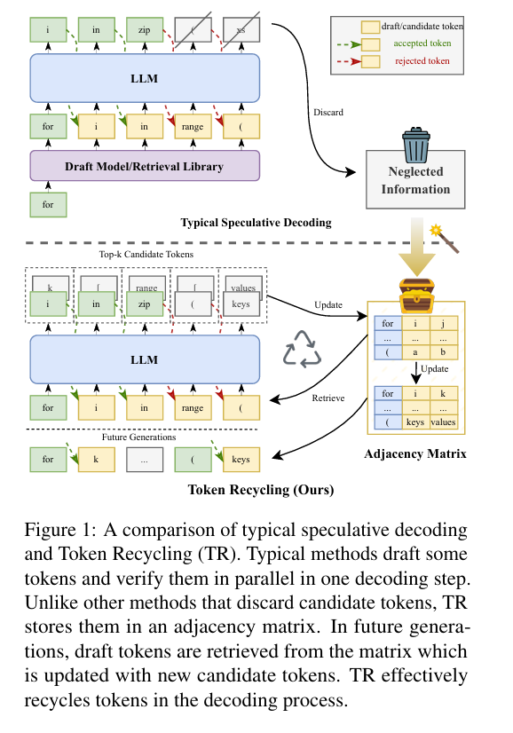
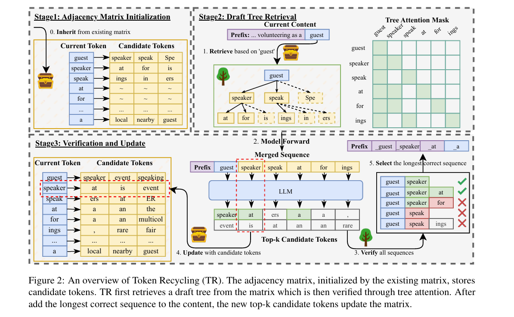

> **一句话概括：** Token Recycling（TR）把目标模型在验证过程中已经计算、却通常会被丢弃的 top-k 候选 token 保存下来，在后续解码中将它们重新组织成草稿树。它不需要训练 draft model，也不需要增加 MTP 或 Medusa Head，而是让目标模型“回收”自己过去算过的候选答案。

## 论文要解决什么问题

普通自回归解码每次只提交一个 token。以 greedy decoding 为例，目标模型虽然会计算整个词表上的概率分布，但最终只保留 top-1：

```text
当前上下文：... volunteering as a guest

top-1  speaker   ← 被选中
top-2  speak
top-3  event
top-4  speaking
```

`speak`、`event` 和 `speaking` 在这一轮没有胜出，通常会被直接丢弃。然而这些候选并不一定是无用的：

- 当前没有被选中的 token，未来可能在相似上下文中成为正确答案；
- 被拒绝分支上的模型输出，仍然包含有价值的局部转移关系；
- 这些概率分布本来就是目标模型前向计算的结果，保存其 top-k 不需要再调用一个生成模型。

TR 的思路因此非常直接：记录“每个 token 后面最可能出现哪些 token”，下次再看到它时，从这些关系中构造候选路径，交给目标模型并行验证。



*传统投机解码会丢弃未被接受的候选；TR 将候选写入邻接矩阵，供后续生成检索。*

## 核心数据结构：邻接矩阵

TR 维护一个形状为 `|V| × K` 的邻接矩阵 `M`：

- `V` 是词表，`|V|` 是词表大小；
- `K` 是每个 token 保存的候选后继数量；
- `M[i]` 保存 token `i` 后面概率最高的 K 个 token ID。

假设 `K = 3`，矩阵中的一部分可能是：

| 当前 token | 候选后继 token |
| --- | --- |
| `guest` | `speaker`, `speak`, `event` |
| `speaker` | `at`, `for`, `is` |
| `speak` | `ing`, `in`, `ers` |
| `at` | `a`, `the`, `an` |

它本质上是一张一阶 token 转移图。更新时，目标模型已经给出了完整上下文下的条件分布：

```text
M[xᵢ] = top-k P(next token | x₀, ..., xᵢ)
```

但后续查询只使用当前 token `xᵢ` 作为索引，相当于把完整上下文下的转移关系近似压缩为：

```text
P(xᵢ₊₁ | x₀, ..., xᵢ)  →  P(xᵢ₊₁ | xᵢ)
```

这是 TR 极其轻量的原因，也是它最重要的近似与局限：相同 token 在不同语境中的候选会写入同一行，完整上下文信息不会被保留。

## 完整工作流程

一次 TR 解码可以拆成四步。

### 1. 根据当前 token 查询候选

假设当前序列结尾是：

```text
... volunteering as a guest
```

以最后一个 token `guest` 查询邻接矩阵：

```text
M[guest] = [speaker, speak, event]
```

这三个 token 就是草稿树的第一层候选。

### 2. 递归查询并构造草稿树

TR 不只查询一层，还会继续沿候选关系展开：

```text
M[speaker] = [at, for, is]
M[speak]   = [ing, in, ers]
```

由此可得到多条候选路径：

```text
guest → speaker → at
guest → speaker → for
guest → speak   → ing
```

这个过程类似 BFS，但并非完整、均匀地展开。论文使用预定义的静态非平衡树：排名靠前的候选可以获得更多子节点并延伸得更深，低概率候选只分配少量节点；总节点数保持固定，以便预先准备 attention mask 和相关 CUDA 数据结构。

一个容易混淆的细节是更新时机。TR 会先使用**旧矩阵**构造完整草稿树，再由目标模型一次前向验证整棵树；验证结束后，才用各节点 logits 的 top-k **批量更新**矩阵，供下一轮解码使用。

### 3. 使用 Tree Attention 并行验证

如果分别验证每条路径，目标模型仍然需要执行多次前向，投机解码就失去了意义。Tree Attention 会把整棵树压平成一个合并序列：

```text
[guest, speaker, speak, event, at, for, ing]
```

然后通过 attention mask 限制每个节点的可见范围：

- `at` 只能看到 `guest → speaker → at`；
- `for` 只能看到 `guest → speaker → for`；
- `ing` 只能看到 `guest → speak → ing`；
- 兄弟分支之间互不可见。

这样，一次目标模型前向就能验证多条候选路径，同时保持每条路径的因果依赖正确。

### 4. 接受最长正确路径

假设目标模型真实的 greedy 输出是：

```text
guest → speaker → at → a
```

那么草稿路径 `guest → speaker → at` 连续命中，可以一次确认多个 token。若另一条路径是 `guest → speaker → for`，而目标模型在 `speaker` 后选择了 `at`，它就会在 `for` 处停止匹配。

最终，TR 选择连续匹配最长的路径，并补上目标模型在首个失败位置给出的正确 token，保证结果与目标模型原始解码一致。



*TR 先从邻接矩阵检索草稿树，再用 Tree Attention 验证，最后接受最长正确路径并更新矩阵。*

## 为什么叫 Token Recycling

验证整棵树时，目标模型会为树中每个节点产生一个完整词表分布。例如：

```text
P(next | ... guest)         → [speaker, event, speaking, ...]
P(next | ... guest speaker) → [at, is, event, ...]
P(next | ... guest speak)   → [ers, at, ER, ...]
P(next | ... speaker at)    → [a, an, the, ...]
```

TR 保留每个分布中概率最高的 K 个 token：

```text
M[guest]   = [speaker, event, speaking]
M[speaker] = [at, is, event]
M[speak]   = [ers, at, ER]
M[at]      = [a, an, the]
```

即使 `speak` 所在的路径最终没有被接受，它后面的 top-k 结果仍会进入矩阵。整个过程由此形成闭环：

1. 查询邻接矩阵；
2. 构造草稿树；
3. 由目标模型并行验证；
4. 接受最长正确路径；
5. 回收所有已验证节点的 top-k，更新邻接矩阵。

所谓“把 trash tokens 变成 treasure tokens”，指的正是对这些已计算但未被采用的候选进行再利用。

## 热启动：跨请求复用矩阵

如果邻接矩阵初始全为零，新请求开始时就没有可用的候选关系，必须经过若干轮解码才能逐步积累。论文使用 **Hot Start** 缓解冷启动：新请求继承先前请求运行后得到的邻接矩阵，而不是每次重新清空。

这种复用让系统能更早构造有效草稿树。不过从方法机制上看，它也意味着矩阵中的局部转移统计来自之前处理过的上下文；在输入分布变化明显时，候选的命中率可能随之变化。

## 为什么一个很小的矩阵就够用

以词表大小 32,000、`K = 8`、每个候选 ID 使用 64 位整数为例：

```text
32,000 × 8 × 8 bytes = 2,048,000 bytes ≈ 1.95 MiB
```

矩阵不保存完整概率分布、hidden state、KV Cache、完整上下文、n-gram 字符串或外部语料索引，只保存：

```text
token_id → 8 个 candidate_token_id
```

因此候选检索可以直接通过 GPU tensor indexing 完成，不需要字符串匹配或数据库查询。TR 用上下文精度换取了非常低的存储和检索开销。

## 我的理解：优势与边界

TR 最有价值的地方，不是发明了另一个“猜 token”的模型，而是重新审视目标模型前向计算中的浪费：既然验证阶段已经得到大量候选分布，就应尽可能把它们变成后续解码的草稿来源。

它的工程优势很明确：

- **无需训练**：不引入单独的 draft model、MTP Head 或额外训练流程；
- **存储很小**：仅保存 token ID 级别的邻接关系；
- **检索简单**：矩阵可常驻 GPU，通过索引直接读取；
- **结果无损**：候选始终由目标模型验证，接受规则不改变目标模型原本的输出。

边界也同样清楚：

- **上下文被压缩**：同一个 token 在不同语境下共享一组候选，一阶关系可能产生歧义；
- **依赖候选复现**：如果后续生成与历史局部转移差异很大，回收候选的命中率会下降；
- **树结构需要取舍**：固定节点预算有利于内核与 mask 预分配，但无法为每个上下文动态找到最优展开方式；
- **冷启动需要积累**：Hot Start 可以缓解，但不能消除数据分布变化带来的影响。

总体来看，Token Recycling 是一种典型的系统型优化：它接受一个粗粒度的一阶近似，换来训练成本、显存开销和检索复杂度都很低的草稿生成机制。真正的关键不在于“预测得多聪明”，而在于把目标模型已经付过计算成本的信息再利用一次。

## 论文信息

- 论文：[Turning Trash into Treasure: Accelerating Inference of Large Language Models with Token Recycling](https://arxiv.org/abs/2408.08696)
- 会议：ACL 2025
- 关键词：speculative decoding、training-free、draft tree、tree attention、adjacency matrix
